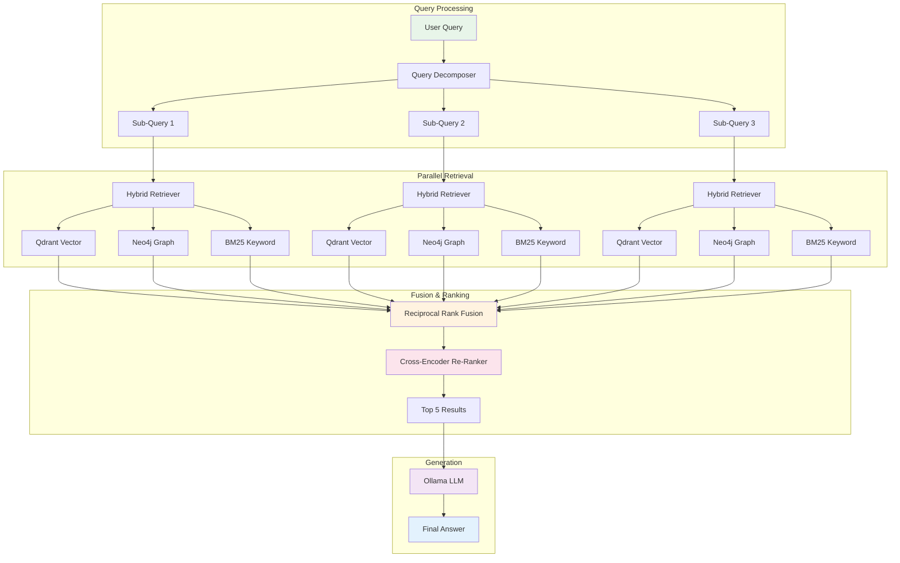

# 🧠 Lilly X — Advanced RAG System

[](https://www.python.org/)
[](https://www.llamaindex.ai/)
[](https://neo4j.com/)
[](https://qdrant.tech/)
[](https://ollama.ai/)
[](https://fedoraproject.org/)

> **Sovereign AI** meets **Cognitive Pipeline Engineering**  
> A production-grade Hybrid RAG system leveraging Graph Knowledge + Vector Search, optimized for AMD Ryzen AI MAX-395 and containerized inference.

---

## 🎯 Overview

**Lilly X** is an advanced Retrieval-Augmented Generation (RAG) system that goes beyond traditional vector search. By combining **hybrid retrieval strategies**, **reciprocal rank fusion**, and **cross-encoder re-ranking**, it delivers state-of-the-art accuracy for complex knowledge retrieval tasks.

### Key Differentiators

- 🔄 **Hybrid Search Architecture**: Combines Qdrant vector search, Neo4j graph traversal, and BM25 keyword matching
- 🧩 **Query Transformation Pipeline**: Decomposes complex queries, generates HyDE embeddings, and rewrites queries for optimal retrieval
- 🎯 **Reciprocal Rank Fusion**: Intelligently merges results from multiple retrieval strategies
- 🏆 **Cross-Encoder Re-ranking**: Final precision layer using BAAI/bge-reranker-v2-m3
- 🚀 **Hardware-Optimized**: Tuned for AMD Ryzen AI MAX-395 (32 cores, 128GB RAM, 32GB iGPU VRAM)
- 🐳 **Containerized Inference**: Podman-compatible Ollama deployment for reproducible AI

---

## 🏗️ Architecture

The system implements a sophisticated **Cognitive Pipeline** that processes queries through multiple transformation and retrieval stages:



### Component Breakdown

| Component | Technology | Purpose |
|-----------|-----------|---------|
| **Query Transformation** | `src/advanced_rag/query_transform.py` | Decomposes complex queries, generates HyDE embeddings, rewrites for recall |
| **Hybrid Retrieval** | `src/advanced_rag/retrieval.py` | Orchestrates parallel vector, graph, and keyword search |
| **Rank Fusion** | `src/advanced_rag/fusion.py` | Merges results using Reciprocal Rank Fusion (RRF) |
| **Re-Ranking** | `src/advanced_rag/rerank.py` | Cross-encoder final precision layer |
| **Vector Store** | Qdrant | High-performance similarity search with HNSW indexing |
| **Graph Store** | Neo4j | Knowledge graph for entity relationships and context expansion |
| **LLM** | Ollama (Mistral-Nemo 12B) | Local containerized inference engine |
| **Embeddings** | BAAI/bge-m3 | State-of-the-art multilingual embeddings |

---

## ⚡ Hardware Optimization

This system is specifically optimized for the **AMD Ryzen AI MAX-395** platform:

```
CPU:    AMD Ryzen AI MAX-395 (32 cores @ 5.1GHz)
RAM:    128GB DDR5
GPU:    Radeon 8060S iGPU (32GB VRAM)
OS:     Fedora 42 (Kernel 6.x)
```

### Performance Tuning

- **Parallel Processing**: 8-worker ingestion pipeline leveraging 32 cores
- **Batch Optimization**: Batch size 64 for embedding generation (32GB VRAM)
- **Containerization**: Podman-native Ollama deployment for isolation
- **Future iGPU Offload**: Prepared for OpenCL/ROCm acceleration (Phase 2)

---

## 🚀 Quick Start

### Prerequisites

Ensure you have the following services running:

```bash
# 1. Qdrant (Vector Database)
podman run -d -p 6333:6333 \
  -v qdrant_storage:/qdrant/storage \
  --name qdrant \
  qdrant/qdrant:latest

# 2. Neo4j (Graph Database)
podman run -d -p 7474:7474 -p 7687:7687 \
  -v neo4j_data:/data \
  -e NEO4J_AUTH=neo4j/password \
  --name neo4j \
  neo4j:latest

# 3. Ollama (LLM Inference)
# Ensure Ollama is installed and running as a systemd service
systemctl status ollama
```

### Installation

```bash
# Clone the repository
cd /path/to/LLIX

# Install Python dependencies
./scripts/install_dependencies.sh

# Configure LLM model (interactive)
./scripts/fix_llm.sh

# Set up environment variables
cp .env.example .env  # Edit with your settings
```

### Ingestion

Ingest your documents into the RAG system:

```bash
# Place documents in data/docs/
mkdir -p data/docs
cp /path/to/your/documents/* data/docs/

# Run ingestion pipeline
./run_ingestion.sh
```

### Run the Application

```bash
# Start Streamlit UI
streamlit run src/app.py

# Or use the convenience script
./run_llix.sh
```

The UI will be available at: `http://localhost:8501`

---

## 📋 Features

### 🧠 Cognitive Pipeline

1. **Query Decomposition**
   - Breaks complex multi-faceted questions into atomic sub-queries
   - Parallel processing of sub-queries for comprehensive coverage

2. **HyDE (Hypothetical Document Embeddings)**
   - Generates hypothetical answers to improve retrieval precision
   - Searches for documents similar to ideal answers, not just queries

3. **Query Rewriting**
   - Expands queries with synonyms and reformulations
   - Improves recall by matching varied terminology

4. **Hybrid Retrieval**
   - **Vector Search**: Semantic similarity via Qdrant (HNSW)
   - **Graph Traversal**: Entity relationships via Neo4j (Cypher)
   - **Keyword Search**: BM25 lexical matching for exact terms

5. **Reciprocal Rank Fusion**
   - Merges results from multiple retrievers
   - Weighted voting system for robust ranking

6. **Cross-Encoder Re-Ranking**
   - Final precision layer using BAAI/bge-reranker-v2-m3
   - Bi-encoder → Cross-encoder two-stage pipeline

---

## 📂 Project Structure

```
LLIX/
├── src/
│   ├── advanced_rag/          # Advanced RAG modules
│   │   ├── query_transform.py # Query decomposition, HyDE, rewriting
│   │   ├── retrieval.py       # Hybrid retriever orchestration
│   │   ├── fusion.py          # Reciprocal Rank Fusion
│   │   ├── rerank.py          # Cross-encoder re-ranking
│   │   └── pipeline.py        # End-to-end RAG pipeline
│   ├── config.py              # Centralized configuration
│   ├── ingest.py              # Document ingestion pipeline
│   ├── rag_engine.py          # Core RAG query engine
│   └── app.py                 # Streamlit UI
├── scripts/
│   ├── install_dependencies.sh # Automated dependency installation
│   └── fix_llm.sh             # Ollama model management
├── data/
│   └── docs/                  # Document repository
├── tests/
│   └── verification/          # Performance benchmarks
├── requirements.txt           # Python dependencies
├── compose.yaml               # Podman/Docker services
└── README.md                  # This file
```

---

## 🔧 Configuration

All configuration is managed via `.env` and `src/config.py`:

```bash
# LLM Configuration
LLM_MODEL=mistral-nemo:12b
OLLAMA_BASE_URL=http://localhost:11434

# Vector Store
QDRANT_URL=http://127.0.0.1:6333
QDRANT_COLLECTION=tech_books

# Graph Store
NEO4J_URL=bolt://localhost:7687
NEO4J_USER=neo4j
NEO4J_PASSWORD=password

# Embeddings
EMBED_MODEL=BAAI/bge-m3

# Performance Tuning
CHUNK_SIZE=1024
BATCH_SIZE=64
TOP_K_RETRIEVAL=25
TOP_K_FINAL=5
```

---

## 🧪 Verification

Run system verification tests:

```bash
# Verify Qdrant connection
./verify_qdrant.sh

# Verify Neo4j connection
./verify_neo4j.sh

# Full system verification
./verify_setup.sh
```

---

## 📊 Evaluation

The system includes built-in evaluation using [Ragas](https://github.com/explodinggradients/ragas):

```bash
# Run evaluation pipeline
python -m src.evaluation

# Generate synthetic test data
python tests/verification/generate_testset.py
```

Metrics tracked:
- **Context Precision**: Relevance of retrieved chunks
- **Context Recall**: Coverage of ground truth
- **Faithfulness**: Alignment of answer to context
- **Answer Relevance**: Alignment of answer to query

---

## 🛠️ Development

### Testing Individual Modules

Each module includes self-contained tests:

```bash
# Test query transformation
python src/advanced_rag/query_transform.py

# Test hybrid retrieval
python src/advanced_rag/retrieval.py

# Test reranker performance
python tests/verification/verify_reranker_performance.py
```

### Extending the System

See [CONTRIBUTING.md](./CONTRIBUTING.md) for guidelines on:
- Adding new retrieval strategies
- Implementing custom rerankers
- Extending query transformation techniques

---

## 📚 Documentation

- [QUICKSTART.md](./QUICKSTART.md) - Detailed setup guide
- [HARDWARE_OPTIMIZATIONS.md](./HARDWARE_OPTIMIZATIONS.md) - Platform-specific tuning
- [INGESTION.md](./INGESTION.md) - Document processing pipeline
- [src/advanced_rag/QUICKSTART.md](./src/advanced_rag/QUICKSTART.md) - Advanced RAG module guide

---

## 🌟 Acknowledgments

Built with:
- [LlamaIndex](https://www.llamaindex.ai/) - RAG orchestration framework
- [Qdrant](https://qdrant.tech/) - High-performance vector database
- [Neo4j](https://neo4j.com/) - Graph database platform
- [Ollama](https://ollama.ai/) - Local LLM inference engine
- [FlagEmbedding](https://github.com/FlagOpen/FlagEmbedding) - State-of-the-art embeddings and rerankers

---

## 📝 License

This project is released under the MIT License. See [LICENSE](./LICENSE) for details.

---

## 🤝 Contributing

Contributions are welcome! Please read [CONTRIBUTING.md](./CONTRIBUTING.md) for details on our code of conduct and the process for submitting pull requests.

---

**Built with 💜 on Fedora 42 | AMD Ryzen AI MAX-395**
