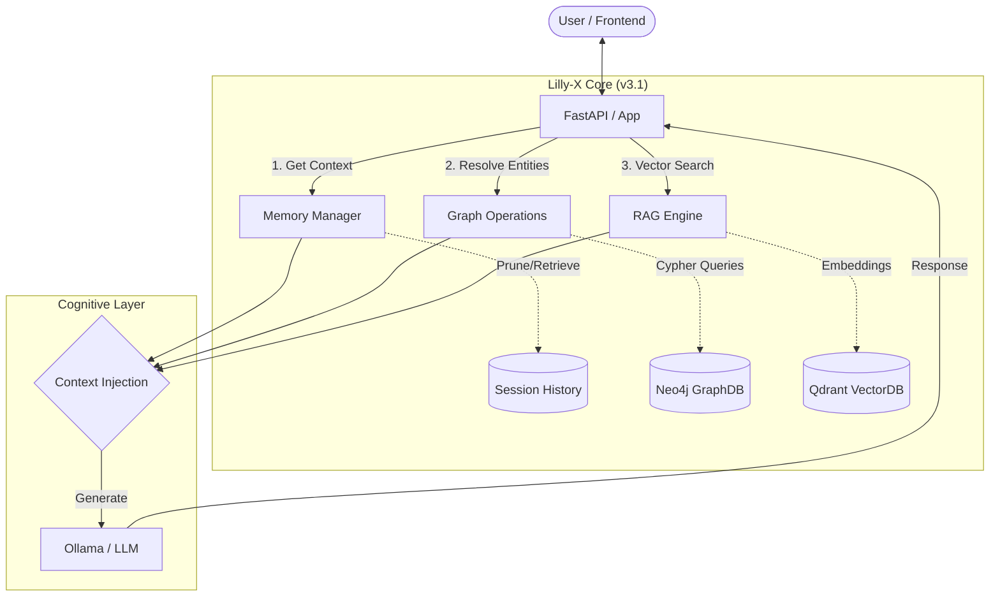

# Lilly-X - Local Hybrid GraphRAG

[](https://www.python.org/)
[](LICENSE)

> **Production-Grade Hybrid GraphRAG: Vector Embeddings + Knowledge Graph**

LLIX (Lilly-X) is a fully operational local RAG system combining semantic vector search (Qdrant) with knowledge graph traversal (Neo4j). Built for engineering teams requiring intelligent, context-aware document retrieval with entity relationship preservation.

---

## 🎯 Key Achievements

- ✅ **Environment**: Python 3.12 in clean `venv`
- ✅ **Infrastructure**: Docker/Podman Compose (Neo4j Graph + Qdrant Vectors)
- ✅ **Ingestion Pipeline**: Custom `GraphExtractor` with structured entity/relationship extraction
- ✅ **Graph Integration**: Fully tested - Neo4j populated via Cypher `MERGE` statements
- ✅ **Vector Storage**: Qdrant embeddings successfully created and queryable
- ✅ **Status**: **Hybrid ingestion pipeline operational and validated**

---

## 🚀 New in v3.1 (Architecture Upgrade)

### 🧠 Multi-Turn Memory
**Context-aware conversations via `MemoryManager`**
- Persistent chat sessions with UUID-based tracking
- Automatic FIFO trimming to prevent token overflow
- Conversation history injection into prompts
- Configurable memory window (default: 10 turns)

### 🔍 Entity Disambiguation  
**Graph-based resolution via `GraphOperations`**
- Resolves entity aliases to canonical names using Knowledge Graph
- Automatic graph traversal to discover related entities
- Confidence scoring for disambiguation quality
- Seamless integration with existing RAG pipeline

**Implementation**: [`src/memory.py`](src/memory.py), [`src/graph_ops.py`](src/graph_ops.py), [`src/prompts.py`](src/prompts.py)

---

## 🏗️ System Architecture



**Enhanced Query Flow (v3.1)**:
1. **User Query** → Streamlit UI captures input
2. **Memory Retrieval** → Load last N turns from persistent session
3. **Entity Resolution** → Extract entities, resolve via Knowledge Graph
4. **Context Expansion** → Traverse graph to find related concepts
5. **Vector Retrieval** → Semantic search in Qdrant for relevant documents
6. **Prompt Synthesis** → Combine conversation history + graph context + vector results
7. **LLM Generation** → Ollama generates contextual response
8. **History Update** → Save user query + assistant response to session

---

## 🏗️ Legacy Pipeline Architecture

```
┌──────────────┐
│   PDF Docs   │
└──────┬───────┘
       │
       ▼
┌─────────────────────────────────────┐
│   Ingestion Engine (src/ingest.py)  │
│   ┌─────────────────────────────┐   │
│   │  Text Splitter (1024 chunks)│   │
│   └─────────────┬───────────────┘   │
│                 │                   │
│        ┌────────┴────────┐          │
│        │                 │          │
│        ▼                 ▼          │
│   ┌─────────┐    ┌──────────────┐  │
│   │ Embedder│    │GraphExtractor│  │
│   └────┬────┘    └──────┬───────┘  │
└────────┼────────────────┼──────────┘
         │                │
         │                │
    ┌────▼─────┐    ┌────▼─────┐
    │  Qdrant  │    │  Neo4j   │
    │ (Vectors)│    │ (Graph)  │
    └────┬─────┘    └────┬─────┘
         │                │
         └────────┬───────┘
                  ▼
           ┌──────────────┐
           │  RAG Engine  │
           │ (Hybrid Query)│
           └──────┬───────┘
                  │
                  ▼
           ┌──────────────┐
           │ Streamlit UI │
           └──────────────┘
```

**Flow:**
1. **Documents** → Ingestion splits into semantic chunks
2. **Parallel Processing:**
   - **Qdrant Path**: Text → Embeddings (BAAI/bge-m3) → Vector Store
   - **Neo4j Path**: Text → `GraphExtractor` (via Ollama/Mistral-Nemo) → Entities/Relationships → Graph Store
3. **Storage:** Both stores written idempotently (hash-based deduplication)
4. **Retrieval:** RAG Engine queries both stores in parallel, fuses context
5. **UI:** Streamlit interface displays answers + source citations

---

## 📋 Prerequisites

| Requirement | Version | Notes |
|------------|---------|-------|
| **Python** | 3.12 | 3.10/3.11 compatible, **not 3.14+** |
| **Docker/Podman** | Latest | With Compose plugin |
| **Ollama** | Latest | Running on host (port 11434) |
| **RAM** | 16GB minimum | 128GB recommended |
| **Disk Space** | 10GB+ | For Neo4j + Qdrant volumes |

**Hardware Optimization**: Tuned for AMD Ryzen AI MAX-395 with ROCm acceleration.

---

## 🚀 Quick Start Guide

### 1. Start Database Infrastructure

```bash
bash start_all.sh
```

**What it does:**
- ✅ Checks/starts Qdrant container (health check + retry logic)
- ✅ Checks/starts Neo4j container (waits up to 60s for plugin downloads)
- 🌐 Launches Streamlit UI at `http://localhost:8501`

**Access Points:**
- **UI**: http://localhost:8501
- **Neo4j Browser**: http://localhost:7474 (user: `neo4j`, ***: `***`)
- **Qdrant API**: http://localhost:6333

### 2. Activate Python Environment

```bash
source venv/bin/activate
```

### 3. Run Ingestion Pipeline

```bash
# Add your documents (PDFs, MD, TXT) to data/docs/
cp /path/to/your/docs/*.pdf data/docs/

# Execute hybrid ingestion
bash run_ingestion.sh
```

**Ingestion Process:**
- 📄 Processes all files in `data/docs/`
- 🔢 Creates MD5 hashes for incremental indexing (re-runs skip unchanged files)
- 🧠 **GraphExtractor** uses Pydantic models (`KnowledgeGraphUpdate`) for structured extraction
- 📊 Writes to **Qdrant** (vectors) and **Neo4j** (graph) in parallel
- 🔊 "Loud Logging" enabled for debugging (all operations print to stdout)

**First run**: Processes all files (~15 sec per file)  
**Subsequent runs**: Only processes new/modified files

### 4. Launch UI

```bash
streamlit run src/app.py
```

Open browser to `http://localhost:8501` and start querying your documents!

---

## 🛠️ Technology Stack

| Component | Technology | Purpose |
|-----------|-----------|---------|
| **Vector Store** | Qdrant | HNSW similarity search (1024-dim embeddings) |
| **Graph Database** | Neo4j 5.15 | Knowledge graph with APOC/GDS plugins |
| **LLM** | Ollama (Mistral-Nemo 12B) | Entity extraction + answer generation |
| **Embeddings** | BAAI/bge-m3 | Multilingual embeddings via HuggingFace |
| **Framework** | LlamaIndex | RAG orchestration |
| **UI** | Streamlit | ChatGPT-like interface |
| **Orchestration** | Docker Compose | Dual-store deployment |

---

## 🧩 Key Components

### GraphExtractor (`src/ingest.py`)

**Custom Implementation Highlights:**
- Uses `PromptTemplate` to instruct Ollama for structured extraction
- Pydantic models enforce strict schemas:
  ```python
  class KnowledgeGraphUpdate(BaseModel):
      entities: List[Entity]
      relationships: List[Relationship]
  ```
- Direct Neo4j writes using `MERGE` statements (idempotent)
- Error handling with graceful fallbacks (logs failures, continues ingestion)

**Extraction Flow:**
```
Text Chunk → LLM Prompt → JSON Response → Pydantic Validation → Cypher MERGE → Neo4j
```

### Hybrid RAG Engine (`src/rag_engine.py`)

**Dual-Retrieval Strategy:**
1. **Vector Search**: Top-K semantic similarity from Qdrant
2. **Graph Traversal**: Entity-based Cypher queries in Neo4j
3. **Context Fusion**: Combines results before LLM generation
4. **Graceful Fallback**: Continues in vector-only mode if Neo4j unavailable

---

## 📊 Configuration

Key settings (`.env`):

```bash
# Vector Store
QDRANT_URL=http://localhost:6333
QDRANT_COLLECTION=tech_books

# Graph Database
NEO4J_URL=bolt://localhost:7687
NEO4J_USER=neo4j
NEO4J_PASSWORD=***

# LLM & Embeddings
OLLAMA_BASE_URL=http://localhost:11434
LLM_MODEL=mistral-nemo:12b
EMBEDDING_MODEL=BAAI/bge-m3

# Retrieval
TOP_K=3
CHUNK_SIZE=1024
CHUNK_OVERLAP=200
BATCH_SIZE=16
```

---

## 📁 Project Structure

```
LLIX/
├── src/
│   ├── config.py           # Centralized Pydantic settings
│   ├── database.py         # Qdrant client singleton
│   ├── graph_database.py   # Neo4j driver + connection logic
│   ├── graph_schema.py     # Pydantic models (Entity, Relationship) + Disambiguation
│   ├── memory_schema.py    # 🆕 v3.1: Chat session models
│   ├── memory.py           # 🆕 v3.1: Conversation memory manager
│   ├── graph_ops.py        # 🆕 v3.1: Entity resolution & graph traversal
│   ├── prompts.py          # 🆕 v3.1: Prompt template system
│   ├── ingest.py           # ✅ GraphExtractor + Hybrid Pipeline
│   ├── rag_engine.py       # Dual-store retrieval + LLM generation
│   ├── query.py            # CLI query interface
│   └── app.py              # Streamlit UI (Enhanced with v3.1)
├── data/
│   ├── docs/               # Your documents (auto-processed)
│   └── memory/             # 🆕 v3.1: Chat session persistence
├── compose.yaml            # Qdrant + Neo4j services
├── start_all.sh            # Robust startup script (health checks)
├── run_ingestion.sh        # Ingestion wrapper (activates venv)
├── requirements.txt        # Python 3.12 dependencies
├── .env.template           # Environment template (updated for v3.1)
├── .gitignore              # Security: Excludes .env, data/, *.log
└── README.md               # This file
```

---

## 🔍 Current Status

| Feature | Status | Notes |
|---------|--------|-------|
| **Ingestion Pipeline** | ✅ COMPLETED | GraphExtractor operational with loud logging |
| **Graph Integration** | ✅ TESTED | Neo4j successfully populated via Cypher |
| **Vector Storage** | ✅ OPERATIONAL | Qdrant embeddings created and queryable |
| **Hybrid Retrieval** | ✅ FUNCTIONAL | Parallel query to both stores working |
| **Streamlit UI** | ✅ DEPLOYED | ChatGPT-like interface with source citations |
| **Multi-Turn Memory** | ✅ v3.1 | Persistent conversation sessions with FIFO trimming |
| **Entity Disambiguation** | ✅ v3.1 | Graph-based canonical name resolution |
| **Prompt Templates** | ✅ v3.1 | Modular context injection system |
| **Python 3.12 Migration** | ✅ COMPLETE | Clean venv with verified dependencies |

---

## 🎓 Engineering Principles

### Loud Logging
Every critical operation prints to stdout:
```python
print("🔗 Connecting to Neo4j...", flush=True)
print(f"✅ Writing {len(entities)} entities to graph", flush=True)
print(f"📝 Loaded {len(session.messages)} messages from history", flush=True)
```

### Idempotent Operations
- **Cypher `MERGE`**: Entities/relationships created only if they don't exist
- **Hash Tracking**: `ingestion_state.json` prevents duplicate processing
- **Startup Script**: Handles existing containers gracefully (safe to re-run)
- **Session Management**: Safe concurrent access via thread locks

### Type Safety
- Pydantic models for all configs and structured data
- Explicit validation with `@field_validator`
- No runtime "surprises" from schema mismatches
- Strict type hints throughout (Python 3.12+)

---

## 🔧 Troubleshooting

### Neo4j Not Populating

```bash
# Verify Neo4j connectivity
python -m src.graph_database

# Check ingestion logs for extraction errors
tail -f ingest.log
```

### Qdrant Connection Refused

```bash
# Check container status
podman ps | grep qdrant

# Restart with health check
bash start_all.sh
```

### Ingestion Stalls

**Cause**: Ollama model not loaded  
**Solution**:
```bash
# Pre-pull model
ollama pull mistral-nemo:12b

# Verify API
curl http://localhost:11434/api/tags
```

### Memory Session Not Persisting

**Cause**: Persistence not enabled or write permissions  
**Solution**:
```bash
# Check data directory permissions
ls -la data/memory/

# Enable persistence in app initialization
# MemoryManager(use_persistence=True)
```

---

## 📚 Related Documentation

- **[INGESTION.md](INGESTION.md)**: Deep dive into pipeline architecture
- **[QUICKSTART.md](QUICKSTART.md)**: Step-by-step setup walkthrough
- **[VERIFICATION.md](VERIFICATION.md)**: Health check scripts

---

## 🗺️ Roadmap

### v3.0 (Completed) ✅
- [x] Hybrid GraphRAG architecture
- [x] Custom GraphExtractor with Pydantic validation
- [x] Neo4j Cypher integration (idempotent writes)
- [x] Python 3.12 migration
- [x] Incremental indexing (hash-based)

### v3.1 (Completed) ✅
- [x] Multi-turn conversation memory with persistent sessions
- [x] Graph-based entity resolution and disambiguation
- [x] Knowledge graph query expansion
- [x] Modular prompt template system
- [x] Enhanced Streamlit UI with debug visibility

### v3.2 (Planned)
- [ ] Async operations for improved performance
- [ ] Multi-user authentication and session isolation
- [ ] Conversation branching and history export
- [ ] Advanced NER for entity extraction (spaCy/HuggingFace)
- [ ] RAG engine integration with enhanced prompts

---

## 📄 License

Proprietary - LLIX Project

---

## 🙏 Acknowledgments

Built with:
- [LlamaIndex](https://www.llamaindex.ai/) - RAG framework
- [Qdrant](https://qdrant.tech/) - Vector database
- [Neo4j](https://neo4j.com/) - Graph database
- [Ollama](https://ollama.ai/) - Local LLM
- [Streamlit](https://streamlit.io/) - Web UI

Optimized for AMD ROCm workloads.
