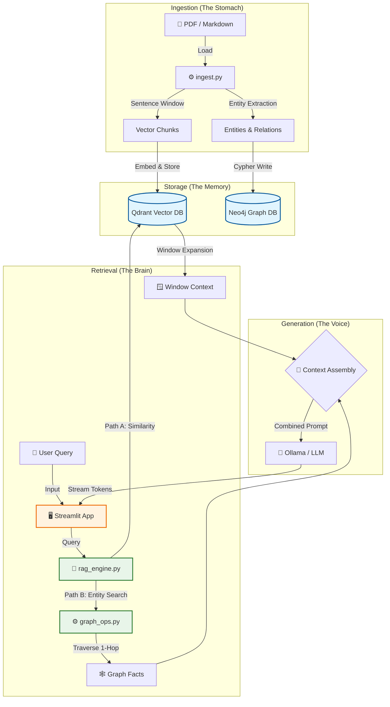

# Lilly-X: Hybrid RAG System (Vector + Graph) 🧠

Lilly-X is a high-performance **Retrieval-Augmented Generation (RAG)** system that combines the precision of **Sentence Window Retrieval** with the deep context of **Knowledge Graphs (Neo4j)**.

## 🏗️ Architecture



## 🚀 Key Features

- **Hybrid Retrieval**: Combines unstructured text vectors with structured graph data.
- **Sentence Windowing**: Retrieves exact matches but feeds the LLM the surrounding context window.
- **Thinking UI**: A visual "Chain of Thought" interface showing real-time retrieval steps.
- **Privacy First**: Designed to run with local LLMs (Ollama) and local DBs.

## ⚡ Quickstart

**Prerequisites**: Python 3.11 (Recommended), Docker/Podman for Databases.

```bash
# 1. Setup Environment
python3.11 -m venv .venv
source .venv/bin/activate
pip install -r requirements.txt

# 2. Start Infrastructure (Qdrant & Neo4j)
podman-compose up -d  # or docker compose

# 3. Ingest Data
# Place your PDFs in ./data/
python -m src.ingest

# 4. Launch UI
streamlit run src/app.py
```

Visit `http://localhost:8501` to start querying! 🎉

## 📁 Project Structure

```
lilly-x/
├── src/
│   ├── app.py              # Streamlit UI with thinking process
│   ├── ingest.py           # Document ingestion pipeline
│   ├── rag_engine.py       # Hybrid retrieval engine
│   ├── graph_ops.py        # Neo4j entity resolution
│   ├── memory.py           # Conversation history
│   └── config.py           # Configuration
├── data/                   # Place documents here
├── .env.template          # Environment variables template
└── requirements.txt       # Python dependencies
```

## ⚙️ Configuration

Copy `.env.template` to `.env` and customize:

```bash
# LLM Settings
LLM_MODEL=mistral:latest
EMBEDDING_MODEL=nomic-embed-text

# Retrieval Strategy (semantic | sentence_window | hierarchical)
RETRIEVAL_STRATEGY=sentence_window
SENTENCE_WINDOW_SIZE=3

# Database Connections
QDRANT_HOST=localhost
QDRANT_PORT=6333
NEO4J_URI=bolt://localhost:7687
NEO4J_USER=neo4j
NEO4J_PASSWORD=password
```

## � Retrieval Strategies

### 1. **Semantic** (Default)
Standard semantic similarity search.

### 2. **Sentence Window** (Recommended)
Retrieves individual sentences but provides surrounding context.  
Example: If sentence 5 matches, returns sentences 2-8 (window_size=3).

### 3. **Hierarchical**
Two-level chunking with auto-merging for structured documents.

## 🎨 UI Features

- **🧠 Thinking Process**: Visual progress bar (0-100%) showing retrieval steps
- **⚡ Live Token Streaming**: Real-time generation with tokens/second metrics
- **📊 Performance Metrics**: Detailed timing breakdown (retrieval vs generation)
- **🔍 Debug Context**: Full transparency into retrieval decisions

## 🔒 Privacy & Security

- **100% Local Execution**: All LLM inference runs on your hardware via Ollama
- **No External Services**: Documents never leave your machine
- **Full Data Control**: No API keys or cloud dependencies required

## 🐛 Troubleshooting

### Qdrant Connection Failed
```bash
podman ps | grep qdrant
podman start qdrant
curl http://localhost:6333/healthz
```

### Neo4j Authentication Error
```bash
podman exec -it neo4j cypher-shell -u neo4j -p password
```

### Python 3.14 Issues
⚠️ **Use Python 3.11 or 3.12** - Python 3.14 has compatibility issues.

## ℹ️ Project Status

This project is a **Proof of Concept (PoC)** designed for educational purposes and architectural demonstration. It serves as a reference implementation for Advanced RAG patterns.

Feedback and discussions are welcome via [Issues](https://github.com/yourusername/lilly-x/issues).

---

**Built with ❤️ for privacy-conscious AI enthusiasts**
