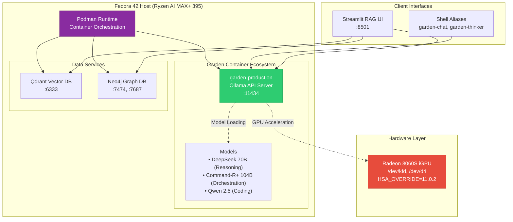
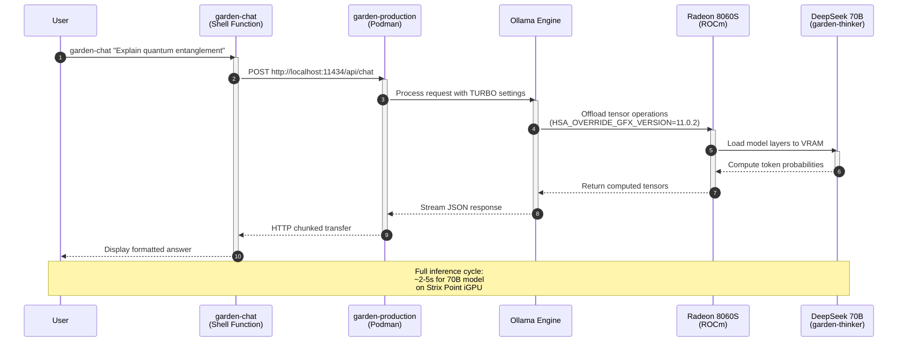

# 🌿 LLIX - Local Intelligence Garden

[](https://www.amd.com/)
[](https://fedoraproject.org/)
[](https://podman.io/)
[](https://ollama.ai/)
[](https://rocmdocs.amd.com/)

> **Local Intelligence Infrastructure for AMD Strix Point APUs**  
> A high-performance containerized Ollama orchestration system designed for AMD Ryzen AI 300 Series (Strix Point) on Fedora 42. Leverage Podman containers to run custom LLM agents optimized for iGPU acceleration.

---

## 🎯 Overview

**LLIX (Local Large Language Model Infrastructure)** provides a production-ready environment for running local AI inference on AMD's Ryzen AI MAX+ 395 APU. The "Garden" system orchestrates multiple Ollama model agents through Podman containers, optimized for the Radeon 8060S iGPU with ROCm acceleration.

### Key Features

- 🚀 **Containerized Ollama**: Podman-native deployment with GPU passthrough
- 🎯 **Multi-Agent System**: Specialized models (Reasoning, Orchestration, Coding)
- ⚡ **Strix Point Optimized**: `HSA_OVERRIDE_GFX_VERSION=11.0.2` for gfx1150 support
- 🔧 **Shell Tooling**: Custom aliases for seamless model interaction
- 📊 **Advanced RAG**: Hybrid search with Graph + Vector retrieval
- 🧠 **128GB RAM**: Massive context and model caching capabilities

---

## 🖥️ Hardware Context

This system is designed and optimized for the following specification:

| Component | Specification |
|-----------|--------------|
| **CPU** | AMD Ryzen AI MAX+ 395 (Strix Point) |
| **Cores** | 32 cores @ 5.1GHz (16P+16E) |
| **RAM** | 128GB DDR5-5600 (64GB allocated as vRAM) |
| **iGPU** | AMD Radeon 8060S (RDNA 3.5, 32GB VRAM) |
| **NPU** | XDNA 2 (50 TOPS AI acceleration) |
| **OS** | Fedora 42 "Bleeding Edge" (Kernel 6.12+) |
| **Runtime** | Podman 5.x with ROCm 6.3+ |

### Why Strix Point?

The **AMD Ryzen AI MAX+ 395** (Strix Point/gfx1150) combines unprecedented APU performance with massive unified memory, making it ideal for local AI workloads:

- **Unified Memory Architecture**: 128GB accessible by CPU, GPU, and NPU
- **iGPU Acceleration**: ROCm-enabled Radeon 8060S for model inference
- **Power Efficiency**: Desktop-class performance in mobile TDP
- **Local-First AI**: No cloud dependencies, full data sovereignty

---

## 🏗️ System Architecture

### Infrastructure Overview



### Data Flow: Shell Alias to Inference



---

## 🛠️ Garden System Components

### Specialized Model Agents

The Garden system provides three specialized Ollama agents, each optimized for different tasks:

| Agent | Model | Size | Purpose | Alias |
|-------|-------|------|---------|-------|
| **garden-thinker** | DeepSeek-R1 70B | ~42GB | Deep reasoning, problem-solving, complex analysis | `garden-chat` |
| **garden-commander** | Command-R+ 104B | ~62GB | Multi-agent orchestration, task planning | `garden-orchestrate` |
| **garden-coder** | Qwen 2.5 Coder | ~14GB | Code generation, debugging, refactoring | `garden-code` |

### Shell Aliases & Functions

Custom shell tooling for seamless Garden interaction:

```bash
# Check Garden container status and loaded models
garden-status

# Restart Garden container with TURBO settings
garden-restart

# Interactive chat with garden-thinker (DeepSeek 70B)
garden-chat "Your question here"

# Check available models and disk usage
garden-models

# View real-time container logs
garden-logs
```

*Note: Aliases are defined in the project's shell configuration scripts.*

---

## 🚀 Installation & Setup

### Prerequisites

Ensure you have:

- **Fedora 42** (or compatible ROCm-supported Linux)
- **Podman 5.x** installed
- **AMD Strix Point APU** (Ryzen AI 300 Series)
- **ROCm 6.3+** drivers

### Step 1: Start the Garden Container

The critical Podman command for Strix Point support:

```bash
podman run -d \
  --name garden-production \
  --restart unless-stopped \
  -p 11434:11434 \
  --device /dev/kfd --device /dev/dri \
  --security-opt seccomp=unconfined \
  --group-add video \
  -v ollama-models:/root/.ollama \
  -e HSA_OVERRIDE_GFX_VERSION=11.0.2 \
  -e OLLAMA_NUM_PARALLEL=4 \
  -e OLLAMA_MAX_LOADED_MODELS=2 \
  ollama/ollama:latest
```

#### Critical Flags Explained

| Flag | Purpose |
|------|---------|
| `--device /dev/kfd` | AMD GPU kernel driver access (ROCm) |
| `--device /dev/dri` | Direct Rendering Infrastructure for GPU |
| `HSA_OVERRIDE_GFX_VERSION=11.0.2` | **Essential for Strix Point (gfx1150)** - Maps to supported ROCm target |
| `OLLAMA_NUM_PARALLEL=4` | Concurrent inference requests (leverages 32 cores) |
| `OLLAMA_MAX_LOADED_MODELS=2` | Keep 2 models in VRAM simultaneously |
| `-p 11434:11434` | Expose Ollama API on host |

> [!CAUTION]
> **Strix Point (gfx1150) Requirement**: The `HSA_OVERRIDE_GFX_VERSION=11.0.2` environment variable is **mandatory** for ROCm GPU acceleration on Ryzen AI MAX+ 395. Without this, Ollama will fall back to CPU-only inference.

### Step 2: Pull Model Agents

```bash
# Connect to the running container
podman exec -it garden-production ollama pull deepseek-r1:70b

# Or use the convenience script
./scripts/connect_garden.sh
```

### Step 3: Start Data Services

```bash
# Qdrant Vector Database
podman run -d \
  --name qdrant \
  -p 6333:6333 -p 6334:6334 \
  -v qdrant_storage:/qdrant/storage:z \
  qdrant/qdrant:latest

# Neo4j Graph Database
podman run -d \
  --name neo4j \
  -p 7474:7474 -p 7687:7687 \
  -v neo4j_data:/data \
  -e NEO4J_AUTH=neo4j/password \
  neo4j:latest
```

### Step 4: Install Python Dependencies

```bash
cd /path/to/LLIX
python3.12 -m venv .venv
source .venv/bin/activate
pip install -r requirements.txt
```

### Step 5: Run the RAG Application

```bash
# Ingest your documents
./run_ingestion.sh

# Start the Streamlit UI
streamlit run src/app.py
```

Open your browser to `http://localhost:8501` to access the RAG interface.

---

## 🔧 Troubleshooting

### Native Build vs. Container Strategy

For **Fedora 42 "Bleeding Edge"** users, containerization is the **recommended strategy** to bypass build incompatibilities:

| Approach | Pros | Cons | Recommended For |
|----------|------|------|-----------------|
| **Container (Garden)** | ✅ Bypasses Fedora 42 build incompatibilities<br/>✅ Isolated environment<br/>✅ Reproducible<br/>✅ No ROCm native build required | ⚠️ Requires correct GPU passthrough<br/>⚠️ Slight overhead (~2-3%) | **Production & Fedora 42** |
| **Native Build** | ✅ Direct ROCm access<br/>✅ Lower latency | ❌ Build incompatibilities on Fedora 42<br/>❌ System package conflicts<br/>❌ Complex ROCm setup | Stable distributions only |

> [!IMPORTANT]
> **Fedora 42 Strategy**: The containerized Garden approach is specifically designed to avoid native Ollama/ROCm build issues on Fedora 42's bleeding-edge packages. By running Ollama inside a container with `HSA_OVERRIDE_GFX_VERSION=11.0.2`, you bypass host system incompatibilities while maintaining full GPU acceleration.

### Common Issues

#### GPU Not Detected in Container

**Symptoms**: Ollama falls back to CPU, slow inference

**Solution**:
```bash
# Verify ROCm devices are accessible
ls -la /dev/kfd /dev/dri

# Check container has access
podman exec garden-production ls -la /dev/kfd /dev/dri

# Ensure HSA_OVERRIDE is set
podman exec garden-production env | grep HSA_OVERRIDE
```

#### Models Not Loading

**Symptoms**: `404 Not Found` or model pull failures

**Solution**:
```bash
# Check container logs
podman logs garden-production

# Verify disk space
df -h

# Re-pull the model inside container
podman exec -it garden-production ollama pull deepseek-r1:70b
```

#### Slow Inference Performance

**Expected Performance** (Strix Point iGPU):
- **DeepSeek 70B**: ~8-12 tokens/second
- **Qwen 2.5 14B**: ~25-35 tokens/second

**Troubleshooting**:
```bash
# Check if GPU is being used
podman exec garden-production rocm-smi

# Verify TURBO settings are active
podman inspect garden-production | grep -A5 "Env"

# Check for thermal throttling
sensors | grep temp
```

---

## 📊 Advanced RAG Features

While LLIX is primarily an inference infrastructure, it includes a sophisticated RAG (Retrieval-Augmented Generation) system:

- **Hybrid Search**: Combines Qdrant vector search, Neo4j graph traversal, and BM25 keyword matching
- **Query Transformation**: Decomposes complex queries, generates HyDE embeddings
- **Reciprocal Rank Fusion**: Intelligently merges results from multiple retrieval strategies
- **Cross-Encoder Re-ranking**: Final precision layer using BAAI/bge-reranker-v2-m3

For detailed RAG documentation, see:
- [Advanced RAG Architecture](./src/advanced_rag/README.md)
- [Hardware Optimizations](./HARDWARE_OPTIMIZATIONS.md)
- [Ingestion Pipeline](./INGESTION.md)

---

## 📂 Project Structure

```
LLIX/
├── src/
│   ├── advanced_rag/          # Advanced RAG modules
│   │   ├── query_transform.py # Query decomposition, HyDE, rewriting
│   │   ├── retrieval.py       # Hybrid retriever orchestration
│   │   ├── fusion.py          # Reciprocal Rank Fusion
│   │   └── rerank.py          # Cross-encoder re-ranking
│   ├── config.py              # Centralized configuration
│   ├── ingest.py              # Document ingestion pipeline
│   ├── rag_engine.py          # Core RAG query engine
│   └── app.py                 # Streamlit UI
├── scripts/
│   ├── connect_garden.sh      # Garden container setup
│   ├── restart_garden_ollama.sh # TURBO mode restart
│   └── install_dependencies.sh
├── data/
│   └── docs/                  # Document repository
├── requirements.txt           # Python dependencies
├── compose.yaml               # Podman/Docker services
└── README.md                  # This file
```

---

## ⚙️ Configuration

Environment variables (`.env`):

```bash
# LLM Configuration (Garden)
LLM_MODEL=deepseek-r1:70b
OLLAMA_BASE_URL=http://localhost:11434

# Vector Store
QDRANT_URL=http://127.0.0.1:6333
QDRANT_COLLECTION=llix_docs

# Graph Store
NEO4J_URL=bolt://localhost:7687
NEO4J_USER=neo4j
NEO4J_PASSWORD=password

# Embeddings
EMBED_MODEL=BAAI/bge-m3

# Performance (Strix Point Optimized)
CHUNK_SIZE=1024
BATCH_SIZE=64
TOP_K_RETRIEVAL=25
TOP_K_FINAL=5
```

---

## 🧪 Verification

Verify your Garden setup:

```bash
# Check all containers are running
podman ps

# Test Ollama API
curl http://localhost:11434/api/tags

# Verify GPU acceleration
podman exec garden-production rocm-smi

# Run system verification
./verify_setup.sh
```

---

## 📚 Additional Documentation

- **[QUICKSTART.md](./QUICKSTART.md)** - Detailed setup guide
- **[HARDWARE_OPTIMIZATIONS.md](./HARDWARE_OPTIMIZATIONS.md)** - Platform-specific tuning
- **[INGESTION.md](./INGESTION.md)** - Document processing pipeline
- **[VERIFICATION.md](./VERIFICATION.md)** - Testing and validation

---

## 🤝 Contributing

Contributions are welcome! See [CONTRIBUTING.md](./CONTRIBUTING.md) for guidelines.

---

## 📝 License

This project is released under the MIT License.

---

## 🌟 Acknowledgments

Built with:
- [Ollama](https://ollama.ai/) - Local LLM inference engine
- [Podman](https://podman.io/) - Daemonless container runtime
- [ROCm](https://rocmdocs.amd.com/) - AMD GPU compute platform
- [LlamaIndex](https://www.llamaindex.ai/) - RAG orchestration framework
- [Qdrant](https://qdrant.tech/) - High-performance vector database
- [Neo4j](https://neo4j.com/) - Graph database platform

---

**🌿 Built with Local AI on Fedora 42 | AMD Ryzen AI MAX+ 395 (Strix Point)**
