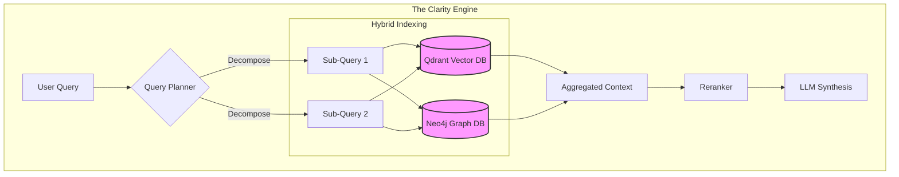
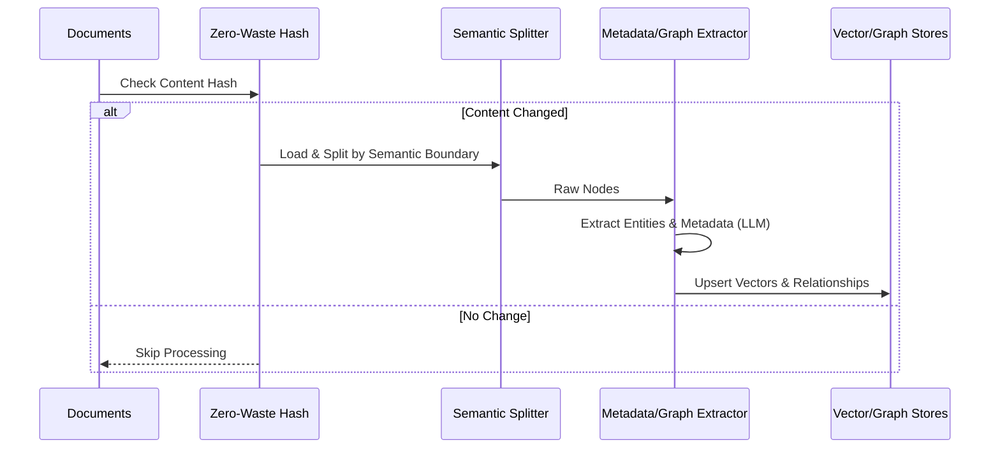
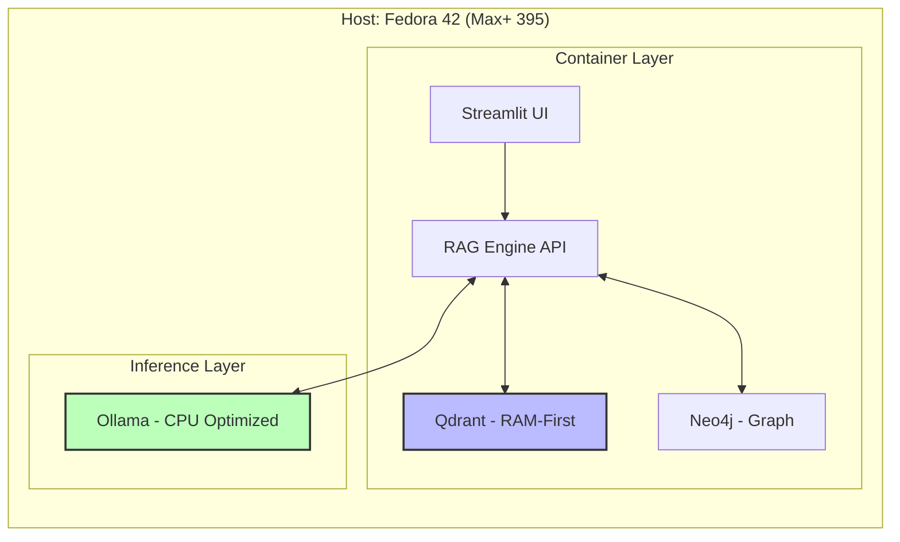

# Lilly-X: High-Performance Sovereign AI Engine

> **"True speed is not an accident; it is the result of deliberate choices."**

**Lilly-X** is a sovereign, hardware-optimized RAG (Retrieval-Augmented Generation) system built for the **AMD Ryzen AI MAX+ 395**. It represents a shift from "Rented AI" to a "Clarity Engine"—prioritizing latency, context, and data sovereignty over cloud dependency.

---

## 🧠 From "Digital Rolodex" to Clarity Engine

In the shift from "Rented" to "Sovereign" AI, the engine is only as powerful as its performance. If retrieval is slow or inaccurate, intelligence cripples into hallucinations. Lilly-X moves beyond simple storage to become an active intelligence layer.

### Beyond Simple Storage: The Repository vs. The Database

The codebase distinguishes between basic storage and active retrieval logic:

* **The Basic Store:** A repository for holding numerical data (vectors).
* **The Optimized Index:** Implemented in [`src/rag_engine.py`](src/rag_engine.py), this is the structured blueprint for *how* we fetch information.
* **The Vector Database:** We utilize **Qdrant** with **HNSW (Hierarchical Navigable Small World)** indexing. This transforms retrieval from a linear file check to a logarithmic search, enabling the "Digital Encyclopedia" capability required for real-time decision support.



---

## ⚡ The Performance Equation: Code-Level Optimization

Speed in Lilly-X is driven by three "Force Multipliers" architected directly into the code:

### 1. RAM-First Architecture

In [`compose.yaml`](compose.yaml), we explicitly set `mmap_threshold_kb: 0`. This instructs the system to load the entire knowledge base into active memory (RAM) rather than reading from disk. This eliminates the "latency tax" of I/O operations.

### 2. Context-Aware Chunking

Traditional RAG systems tear pages at random character counts. In [`src/ingest.py`](src/ingest.py), we implement **Semantic Boundary Detection**. The system recognizes when a topic shifts, preserving the full argument rather than disconnected fragments.

### 3. Zero-Waste Indexing

The system implements cryptographic hashing (`IngestionState`) to detect changes at the file level. Only changed content is re-processed, turning hours of re-indexing into minutes.



---

## ⚖️ The Art of Compromise: Strategic Trade-Offs

Optimization is not about perfection; it is about choosing battles. Lilly-X navigates three critical trade-offs to ensure enterprise-grade reliability:

| Trade-Off | The Lilly-X Choice | Why? |
|-----------|-------------------|------|
| **Build vs. Speed** | Slow Ingestion, Fast Query | We accept a computationally expensive ingestion phase (Semantic Splitting + Graph Extraction) to ensure the AI responds instantly during conversation. |
| **Precision vs. Context** | Semantic Coherence | We use variable-sized chunks that preserve the "full argument" over fixed 500-char fragments. The AI retrieves reasoning, not just bullet points. |
| **Cost vs. Latency** | RAM-First (High Cost) | We consume expensive RAM (`mmap_threshold_kb: 0`) to eliminate disk lag. We optimize for human productivity, not hardware efficiency. |

---

## 🚀 Hardware & Environment Specs

The following configuration is **mandatory** for stability on the AMD Ryzen AI MAX+ 395.

| Component | Specification | Notes |
|-----------|---------------|-------|
| **Device** | AMD Ryzen AI MAX+ 395 | 16 Cores / 32 Threads, 3.0-5.1 GHz |
| **RAM** | 128GB LPDDR5x | Shared Memory Architecture (32GB reserved for iGPU) |
| **OS** | Fedora 42 (Bleeding Edge) | Requires strict Python version management |
| **Python** | **3.12.x** (Strict) | **CRITICAL**: Do NOT use system Python 3.14 |

### System Architecture Overview



---

## 🛠️ Quick Start

### 1. Prerequisites

Ensure you have **Python 3.12** installed (System Python 3.14 will fail with Torch/Pandas):

```bash
sudo dnf install python3.12
```

### 2. Setup Environment

```bash
# Clone repository
git clone https://github.com/UrbanElephant/Lilly-X.git
cd Lilly-X

# Create Virtual Environment (MUST be Python 3.12)
/usr/bin/python3.12 -m venv venv

# Install Modular Dependency Stack
./venv/bin/pip install -r requirements.txt
```

### 3. Run the System

Use the "Golden Script" wrapper to ensure hardware optimizations (`OLLAMA_NUM_THREAD=16`, `ulimit`, etc.) are applied.

**To Ingest Documents (Zero-Waste Pipeline):**

```bash
./run_llix.sh ingest
```

**To Launch UI (Orchestrator Interface):**

```bash
./run_llix.sh ui
```

---

## 📦 Project Structure

* [`src/ingest.py`](src/ingest.py): The "Context-Aware" pipeline. Handles semantic splitting, metadata extraction, and graph construction.
* [`src/rag_engine.py`](src/rag_engine.py): The "Clarity Engine." Contains the logic for Query Planning, Hybrid Retrieval, and Reranking.
* [`compose.yaml`](compose.yaml): The infrastructure definition, specifically tuned for RAM-First execution on 128GB systems.
* [`run_llix.sh`](run_llix.sh): Critical environment exports for AMD Ryzen AI MAX+ stability.

---

## 🎯 PS: THE CODEBASE

> **Note:** This project is a playground to explore local RAG architectures. It is currently in active development and not intended for production use yet.

**Empowering the Human Orchestrator:** This isn't about the AI replacing the human; it is about the AI acting as a force multiplier that allows a manager to focus on strategy, creativity, and empathy.

---

## ⚠️ Known Issues / Troubleshooting

* **Pip Hangs**: If pip gets stuck resolving dependencies, ensure you are using the provided `requirements.txt` and a fresh venv.
* **Ollama 500 Errors**: If you see this, ensure `OLLAMA_NUM_PARALLEL=1` is set (handled by `run_llix.sh`).
* **Neo4j Permission Issues**: If ingestion fails with permission errors, run `docker compose down -v` to clean the volume, then restart.
