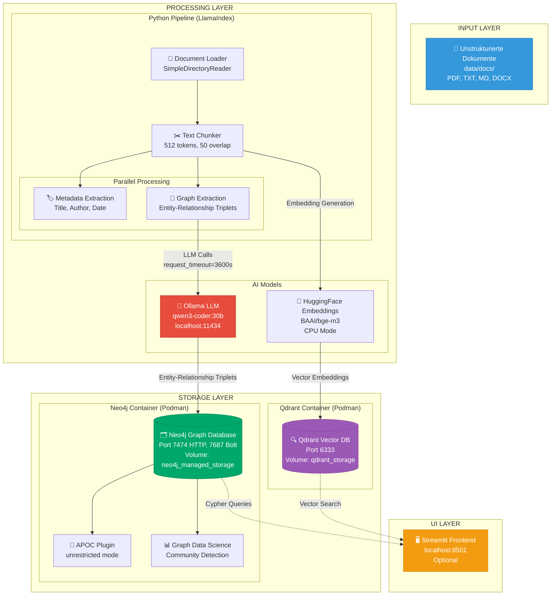
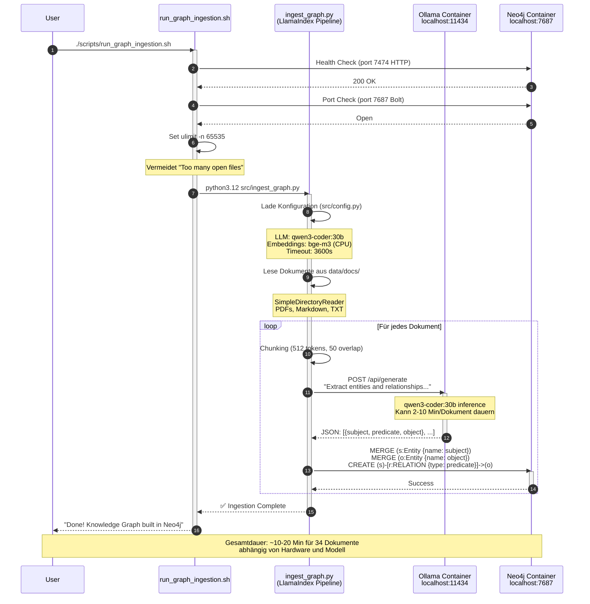
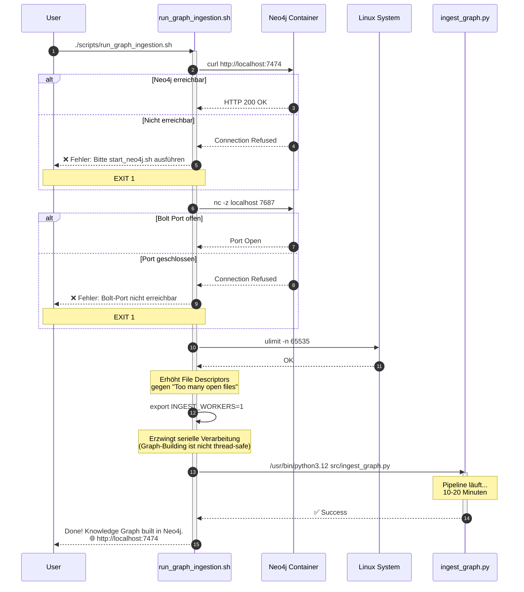

# 🧠 LLIX - Local LLM Knowledge Graph System

[](https://www.gnu.org/philosophy/free-sw.html)
[](https://neo4j.com/)
[](https://ollama.ai/)
[](https://www.python.org/)
[](https://podman.io/)

> **100% Lokales KI-System zur Umwandlung unstrukturierter Dokumente in einen durchsuchbaren Wissensgraphen**  
> Privacy-First • Container-Based • Enterprise-Ready • AMD Strix Optimiert

---

## 📋 Inhaltsverzeichnis

- [Projektübersicht](#-projektübersicht)
- [Architektur & Komponenten](#️-architektur--komponenten)
- [Voraussetzungen](#-voraussetzungen)
- [Setup & Installation](#-setup--installation)
- [Die zentralen Skripte](#-die-zentralen-skripte-deep-dive)
- [Troubleshooting Guide](#-troubleshooting-guide)
- [Konfiguration](#️-konfiguration)
- [Projektstruktur](#-projektstruktur)
- [Weiterführende Dokumentation](#-weiterführende-dokumentation)

---

## 🎯 Projektübersicht

**LLIX (Local LLM Intelligence eXtractor)** ist ein vollständig lokal betriebenes System zur automatischen Extraktion von Wissen aus unstrukturierten Dokumenten und deren Überführung in einen Neo4j-Wissensgraphen. Das System kombiniert modernste LLM-Technologie mit Graph-Datenbanken, um komplexe semantische Beziehungen zwischen Entitäten zu erfassen und durchsuchbar zu machen.

### 🔐 Privacy First - Warum lokal?

- **100% Data Sovereignty**: Alle Daten bleiben auf Ihrer Hardware
- **Keine Cloud-Abhängigkeiten**: Kein Internetzugriff für die Verarbeitung erforderlich
- **DSGVO-Konform**: Ideal für sensible Unternehmensdaten oder persönliche Dokumente
- **Offline-Fähig**: Funktioniert komplett ohne Internetverbindung

### 🏗️ Technologie-Stack

| Komponente | Technologie | Zweck |
|------------|-------------|-------|
| **Orchestrierung** | Python 3.12 + LlamaIndex | Pipeline-Management & RAG-Framework |
| **LLM** | Ollama (qwen3-coder:30b) | Entitäts-Extraktion & Triplet-Generierung |
| **Embeddings** | HuggingFace (bge-m3) | Semantische Vektorisierung |
| **Wissensgraph** | Neo4j 5.x | Graph-Datenbank für Entitäts-Beziehungen |
| **Vektor-DB** | Qdrant | Hybride Retrieval-Suche |
| **Container Runtime** | Podman/Docker | Isolierte, reproduzierbare Umgebung |
| **UI** | Streamlit | Interaktives Frontend (optional) |

---

## 🏛️ Architektur & Komponenten

### Datenfluss-Diagramm

Das folgende Diagramm zeigt den kompletten Datenfluss von rohen Dokumenten bis zur Graph-Datenbank:


```mermaid
graph TD
    subgraph "INPUT LAYER"
        Docs[📁 Unstrukturierte Dokumente<br/>data/docs/<br/>PDF, TXT, MD, DOCX]
    end
    
    subgraph "PROCESSING LAYER"
        subgraph "Python Pipeline (LlamaIndex)"
            Loader[📄 Document Loader<br/>SimpleDirectoryReader]
            Chunker[✂️ Text Chunker<br/>512 tokens, 50 overlap]
            
            subgraph "Parallel Processing"
                ExtractMeta[🏷️ Metadata Extraction<br/>Title, Author, Date]
                ExtractGraph[🧠 Graph Extraction<br/>Entity-Relationship Triplets]
            end
            
            Loader --> Chunker
            Chunker --> ExtractMeta
            Chunker --> ExtractGraph
        end
        
        subgraph "AI Models"
            OllamaLLM[🤖 Ollama LLM<br/>qwen3-coder:30b<br/>localhost:11434]
            HFEmbed[🔢 HuggingFace Embeddings<br/>BAAI/bge-m3<br/>CPU Mode]
            
            ExtractGraph -->|LLM Calls<br/>request_timeout=3600s| OllamaLLM
            Chunker -->|Embedding Generation| HFEmbed
        end
    end
    
    subgraph "STORAGE LAYER"
        subgraph "Neo4j Container (Podman)"
            Neo4jDB[(🗂️ Neo4j Graph Database<br/>Port 7474 HTTP, 7687 Bolt<br/>Volume: neo4j_managed_storage)]
            APOC[🔌 APOC Plugin<br/>unrestricted mode]
            GDS[📊 Graph Data Science<br/>Community Detection]
            
            Neo4jDB --> APOC
            Neo4jDB --> GDS
        end
        
        subgraph "Qdrant Container (Podman)"
            QdrantDB[(🔍 Qdrant Vector DB<br/>Port 6333<br/>Volume: qdrant_storage)]
        end
        
        OllamaLLM -->|Entity-Relationship Triplets| Neo4jDB
        HFEmbed -->|Vector Embeddings| QdrantDB
    end
    
    subgraph "UI LAYER"
        Streamlit[🖥️ Streamlit Frontend<br/>localhost:8501<br/>Optional]
    end
    
    Neo4jDB -.->|Cypher Queries| Streamlit
    QdrantDB -.->|Vector Search| Streamlit
    
    style Docs fill:#3498db,stroke:#2980b9,color:#fff
    style OllamaLLM fill:#e74c3c,stroke:#c0392b,color:#fff
    style Neo4jDB fill:#00A86B,stroke:#008558,color:#fff
    style QdrantDB fill:#9b59b6,stroke:#8e44ad,color:#fff
    style Streamlit fill:#f39c12,stroke:#d68910,color:#fff
```

### System-Interaktionsdiagramm

Dieses Sequenzdiagramm zeigt den detaillierten Ablauf eines vollständigen Ingestion-Prozesses:


```mermaid
sequenceDiagram
    autonumber
    participant User
    participant Script as run_graph_ingestion.sh
    participant Python as ingest_graph.py<br/>(LlamaIndex Pipeline)
    participant Ollama as Ollama Container<br/>localhost:11434
    participant Neo4j as Neo4j Container<br/>localhost:7687
    
    User->>Script: ./scripts/run_graph_ingestion.sh
    activate Script
    
    Script->>Neo4j: Health Check (port 7474 HTTP)
    Neo4j-->>Script: 200 OK
    
    Script->>Neo4j: Port Check (port 7687 Bolt)
    Neo4j-->>Script: Open
    
    Script->>Script: Set ulimit -n 65535
    Note over Script: Vermeidet "Too many open files"
    
    Script->>Python: python3.12 src/ingest_graph.py
    activate Python
    
    Python->>Python: Lade Konfiguration (src/config.py)
    Note over Python: LLM: qwen3-coder:30b<br/>Embeddings: bge-m3 (CPU)<br/>Timeout: 3600s
    
    Python->>Python: Lese Dokumente aus data/docs/
    Note over Python: SimpleDirectoryReader<br/>PDFs, Markdown, TXT
    
    loop Für jedes Dokument
        Python->>Python: Chunking (512 tokens, 50 overlap)
        
        Python->>Ollama: POST /api/generate<br/>"Extract entities and relationships..."
        activate Ollama
        Note over Ollama: qwen3-coder:30b inference<br/>Kann 2-10 Min/Dokument dauern
        Ollama-->>Python: JSON: [{subject, predicate, object}, ...]
        deactivate Ollama
        
        Python->>Neo4j: MERGE (s:Entity {name: subject})<br/>MERGE (o:Entity {name: object})<br/>CREATE (s)-[r:RELATION {type: predicate}]->(o)
        activate Neo4j
        Neo4j-->>Python: Success
        deactivate Neo4j
    end
    
    Python-->>Script: ✅ Ingestion Complete
    deactivate Python
    
    Script-->>User: "Done! Knowledge Graph built in Neo4j"
    deactivate Script
    
    Note over User,Neo4j: Gesamtdauer: ~10-20 Min für 34 Dokumente<br/>abhängig von Hardware und Modell
```

---

## 📦 Voraussetzungen

### Betriebssystem

- **Linux** (empfohlen: Fedora 40+, RHEL 9+, Ubuntu 22.04+)
  - **Fedora/RHEL Vorteile**: Native Podman-Integration, SELinux-Hardening, neuere Kernel
  - **Andere Distros**: Docker als Alternative zu Podman möglich

### Container Runtime

- **Podman 4.x+** (empfohlen) oder **Docker 24.x+**
  - Podman-Vorteil: Daemonless, rootless Container, SELinux-native

### Ollama Installation

**Ollama muss installiert und laufend sein**, bevor Sie LLIX starten:

```bash
# Installation (Linux)
curl -fsSL https://ollama.ai/install.sh | sh

# Oder via Systemd (für Autostart)
sudo systemctl enable --now ollama

# Verifizieren
ollama --version
curl http://localhost:11434/api/tags
```

### Hardware-Empfehlungen

| Komponente | Minimum | Empfohlen | Ideal (getestet) |
|------------|---------|-----------|------------------|
| **CPU** | 8 Kerne | 16 Kerne | **AMD Ryzen AI MAX+ 395** (32 Kerne) |
| **RAM** | 32 GB | 64 GB | **128 GB DDR5-5600** |
| **GPU/APU** | CPU-only | NVIDIA RTX 3060 (12GB) | **AMD Strix Halo (32GB VRAM)** |
| **Speicher** | 100 GB SSD | 500 GB NVMe | 1 TB NVMe |

> [!TIP]
> **AMD Strix Halo Benutzer**: Dieses System wurde speziell auf dem **AMD Ryzen AI MAX+ 395** mit 128GB RAM und Radeon 8060S iGPU (32GB VRAM) entwickelt und optimiert. ROCm 6.3+ wird für GPU-Beschleunigung unterstützt.

### Software-Anforderungen

- **Python 3.10+** (empfohlen: **Python 3.12**)
- **Git** (für Repository-Klonen)
- **curl** & **nc** (für Health Checks)

---

## 🚀 Setup & Installation

### Schritt 1: Repository klonen

```bash
git clone https://github.com/IHR-USERNAME/LLIX.git
cd LLIX
```

### Schritt 2: Python Virtual Environment erstellen

```bash
# Mit Python 3.12 (empfohlen)
python3.12 -m venv .venv

# Oder Standard Python 3
python3 -m venv .venv

# Aktivieren
source .venv/bin/activate

# Pip upgraden
pip install --upgrade pip
```

### Schritt 3: Python-Abhängigkeiten installieren

```bash
pip install -r requirements.txt
```

> [!NOTE]
> Die Installation kann 5-10 Minuten dauern, da `torch`, `transformers` und `sentence-transformers` größere Pakete sind (~2-3 GB).

### Schritt 4: Ollama-Modell herunterladen

```bash
# qwen3-coder:30b herunterladen (ca. 17 GB)
ollama pull qwen3-coder:30b

# Verifizieren
ollama list | grep qwen3-coder
```

**Alternative Modelle** (falls 30B zu groß ist):

```bash
# Kleinere Varianten (experimentell)
ollama pull qwen3-coder:7b   # ~4 GB
ollama pull qwen3-coder:14b  # ~8 GB
```

> [!WARNING]
> Kleinere Modelle liefern möglicherweise schlechtere Entitäts-Extraktion. **30B ist das getestete Minimum für Produktionsqualität.**

### Schritt 5: Container-Dienste starten

```bash
# Neo4j starten (mit optimierten Einstellungen)
./scripts/start_neo4j.sh

# Qdrant starten (optional, für Vektor-Suche)
podman run -d \
  --name qdrant \
  -p 6333:6333 -p 6334:6334 \
  -v qdrant_storage:/qdrant/storage:z \
  qdrant/qdrant:latest
```

### Schritt 6: Konfiguration anpassen (optional)

```bash
# .env-Datei erstellen (Optional, Standardwerte in config.py)
cp .env.example .env

# Wichtigste Einstellungen:
# NEO4J_PASSWORD=password        # Standard aus start_neo4j.sh
# OLLAMA_BASE_URL=http://localhost:11434
```

### Schritt 7: Dokumente vorbereiten

```bash
# Legen Sie Ihre Dokumente in data/docs/ ab
mkdir -p data/docs
cp /pfad/zu/ihren/pdfs/*.pdf data/docs/

# Unterstützte Formate: PDF, TXT, MD, DOCX
```

### Schritt 8: Wissensgraph-Ingestion starten

```bash
# Hauptprozess starten
./scripts/run_graph_ingestion.sh
```

Die Ingestion läuft sequenziell (`num_workers=1`), um Race Conditions zu vermeiden. Fortschritt wird live angezeigt.

### Schritt 9: UI starten (optional)

```bash
# Streamlit-Frontend
streamlit run src/app.py

# Öffnen Sie http://localhost:8501 im Browser
```

---

## 📜 Die zentralen Skripte (Deep Dive)

### 1. `scripts/start_neo4j.sh` - Neo4j Container Orchestrator

**Zweck**: Startet einen produktionsreifen Neo4j-Container mit allen erforderlichen Plugins und Sicherheitsberechtigungen.

#### Funktionsweise

```bash
#!/bin/bash
set -e

CONTAINER_NAME="neo4j"
VOLUME_NAME="neo4j_managed_storage"
NEO4J_USER="neo4j"
NEO4J_PASS="password"

# 1. Alte Container stoppen
podman rm -f $CONTAINER_NAME 2>/dev/null || true

# 2. Volume erstellen (WICHTIG: Kein Bind-Mount!)
podman volume create $VOLUME_NAME

# 3. Container starten
podman run -d \
    --name $CONTAINER_NAME \
    --restart unless-stopped \
    -p 7474:7474 -p 7687:7687 \
    --env NEO4J_AUTH=${NEO4J_USER}/${NEO4J_PASS} \
    --env NEO4J_PLUGINS='["apoc", "graph-data-science"]' \
    --env NEO4J_dbms_security_procedures_unrestricted=apoc.*,gds.* \
    --env NEO4J_dbms_security_procedures_allowlist=apoc.*,gds.* \
    --env NEO4J_apoc_import_file_enabled=true \
    --env NEO4J_apoc_export_file_enabled=true \
    --ulimit=nofile=40000:40000 \
    -v "${VOLUME_NAME}:/data" \
    docker.io/library/neo4j:latest

# 4. Warten auf Verfügbarkeit
until podman exec $CONTAINER_NAME cypher-shell -u $NEO4J_USER -p $NEO4J_PASS "RETURN 'Ready';" > /dev/null 2>&1; do
    echo -n "."
    sleep 2
done

echo "✅ Neo4j ist bereit!"
```

#### Besonderheiten & Design-Entscheidungen

| Feature | Erklärung | Warum wichtig? |
|---------|-----------|----------------|
| **Podman Volume statt Bind-Mount** | `-v neo4j_managed_storage:/data` | **Behebt Permission Denied Fehler** auf SELinux-Systemen (Fedora/RHEL). Podman verwaltet Permissions automatisch. |
| **APOC Unrestricted Mode** | `NEO4J_dbms_security_procedures_unrestricted=apoc.*` | Erlaubt LlamaIndex-Integration (PropertyGraphStore) APOC-Prozeduren ohne Security-Fehler aufzurufen. |
| **GDS Plugin aktiviert** | `NEO4J_PLUGINS='["graph-data-science"]'` | Ermöglicht Community Detection, PageRank, und andere Graph-Algorithmen für fortgeschrittene Analysen. |
| **Hohe File Descriptor Limits** | `--ulimit=nofile=40000:40000` | Verhindert "Too many open files" bei großen Graphen (1M+ Nodes). |
| **Auto-Restart Policy** | `--restart unless-stopped` | Container startet automatisch nach System-Reboot. |

#### Nutzung

```bash
# Starten
./scripts/start_neo4j.sh

# Logs ansehen
podman logs -f neo4j

# Browser-UI öffnen
firefox http://localhost:7474
# Credentials: neo4j / password
```

---

### 2. `src/config.py` - Zentrale Systemkonfiguration

**Zweck**: Definiert alle LLM-, Embedding- und Datenbank-Konfigurationen an einem zentralen Ort.

#### Architektur-Entscheidungen

```python
import os
from llama_index.core import Settings
from llama_index.llms.ollama import Ollama
from llama_index.embeddings.huggingface import HuggingFaceEmbedding

class AppSettings:
    def __init__(self):
        # 1. LLM-Modell (HARDCODED für Stabilität)
        self.llm_model = "qwen3-coder:30b"  # Ignoriert Umgebungsvariablen
        
        # 2. Embedding-Modell
        self.embed_model = "BAAI/bge-m3"
        
        # 3. Datenbank-Verbindungen
        self.neo4j_url = "bolt://localhost:7687"
        self.neo4j_user = "neo4j"
        self.neo4j_password = "password"

def setup_environment():
    # LLM mit 1-Stunden Timeout (für große Dokumente)
    Settings.llm = Ollama(
        model=settings.llm_model,
        base_url="http://localhost:11434",
        request_timeout=3600.0,  # 60 Minuten!
        temperature=0.1
    )
    
    # Embeddings im CPU-Modus (AMD/Strix Stabilität)
    Settings.embed_model = HuggingFaceEmbedding(
        model_name=settings.embed_model,
        device="cpu"  # WICHTIG für AMD APUs!
    )
    
    # Chunk-Größen
    Settings.chunk_size = 512
    Settings.chunk_overlap = 50
```

#### Warum diese Werte?

| Parameter | Wert | Begründung |
|-----------|------|------------|
| **`request_timeout=3600.0`** | 1 Stunde | Qwen3-30B braucht auf CPU 5-10 Min/Dokument. Standard-Timeout (120s) ist zu kurz! |
| **`device="cpu"` für Embeddings** | CPU-Modus | **AMD ROCm ist instabil** für Sentence-Transformers. CPU-Embeddings sind schnell genug (100ms/Chunk). |
| **`chunk_size=512`** | 512 Tokens | Balance zwischen Kontext und Performance. Größere Chunks = mehr VRAM, aber bessere Semantik. |
| **`temperature=0.1`** | Fast deterministisch | Entitäts-Extraktion braucht konsistente, nicht kreative Outputs. |

#### Nutzung

```python
# In jedem Python-Skript:
from src.config import setup_environment

setup_environment()  # Ab jetzt sind Settings.llm und Settings.embed_model konfiguriert
```

---

### 3. `scripts/run_graph_ingestion.sh` - Hauptingestion-Pipeline

**Zweck**: Der Orchestrator-Prozess, der alle Health Checks durchführt und die Python-Ingestion startet.

#### Ablauf-Sequenz


```mermaid
sequenceDiagram
    autonumber
    participant User
    participant Bash as run_graph_ingestion.sh
    participant Neo4j as Neo4j Container
    participant System as Linux System
    participant Python as ingest_graph.py
    
    User->>Bash: ./scripts/run_graph_ingestion.sh
    activate Bash
    
    Bash->>Neo4j: curl http://localhost:7474
    alt Neo4j erreichbar
        Neo4j-->>Bash: HTTP 200 OK
    else Nicht erreichbar
        Neo4j-->>Bash: Connection Refused
        Bash-->>User: ❌ Fehler: Bitte start_neo4j.sh ausführen
        Note over Bash,User: EXIT 1
    end
    
    Bash->>Neo4j: nc -z localhost 7687
    alt Bolt Port offen
        Neo4j-->>Bash: Port Open
    else Port geschlossen
        Neo4j-->>Bash: Connection Refused
        Bash-->>User: ❌ Fehler: Bolt-Port nicht erreichbar
        Note over Bash,User: EXIT 1
    end
    
    Bash->>System: ulimit -n 65535
    System-->>Bash: OK
    Note over Bash: Erhöht File Descriptors<br/>gegen "Too many open files"
    
    Bash->>Bash: export INGEST_WORKERS=1
    Note over Bash: Erzwingt serielle Verarbeitung<br/>(Graph-Building ist nicht thread-safe)
    
    Bash->>Python: /usr/bin/python3.12 src/ingest_graph.py
    activate Python
    Note over Python: Pipeline läuft...<br/>10-20 Minuten
    Python-->>Bash: ✅ Success
    deactivate Python
    
    Bash-->>User: Done! Knowledge Graph built in Neo4j.<br/>🌐 http://localhost:7474
    deactivate Bash
```

#### Besonderheiten

```bash
# 1. Doppelte Connectivity-Checks (HTTP + Bolt)
curl -s http://localhost:7474 > /dev/null       # Neo4j Browser API
nc -z localhost 7687                             # Bolt-Protokoll für Cypher

# 2. Ulimit-Anpassung (File Descriptors)
ulimit -n 65535  # Ohne dies: "OSError: [Errno 24] Too many open files"

# 3. Serielle Verarbeitung erzwingen
export INGEST_WORKERS=1  # Graph-Schreiboperationen sind nicht thread-safe!
```

#### Nutzung

```bash
# Einfacher Start
./scripts/run_graph_ingestion.sh

# Mit Fortschrittsanzeige
./scripts/run_graph_ingestion.sh 2>&1 | tee ingestion.log

# Nach Abschluss: Graph im Browser ansehen
firefox http://localhost:7474
```

**Beispiel-Cypher-Query nach Ingestion**:

```cypher
// Alle Entitäten und ihre Beziehungen anzeigen
MATCH (n)-[r]->(m) 
RETURN n, r, m 
LIMIT 25
```

---

## 🔧 Troubleshooting Guide

Dieser Abschnitt basiert auf **echten Produktionsproblemen** während der Entwicklung auf Fedora 42 + AMD Strix Halo.

### Problem 1: Neo4j Permission Denied

#### Symptom

```bash
podman logs neo4j
# Output:
# chown: changing ownership of '/data': Operation not permitted
# Neo4j cannot start!
```

#### Root Cause

**Bind-Mounts** (`-v ~/neo4j_data:/data`) funktionieren **nicht korrekt mit SELinux** auf Fedora/RHEL. Der Container kann nicht auf Host-Verzeichnisse schreiben.

#### Lösung ✅

**Nutze Podman Managed Volumes statt Bind-Mounts:**

```bash
# ❌ FALSCH (Bind-Mount)
podman run -v ~/neo4j_data:/data neo4j:latest

# ✅ RICHTIG (Managed Volume)
podman volume create neo4j_managed_storage
podman run -v neo4j_managed_storage:/data neo4j:latest
```

Podman verwaltet Permissions automatisch. **Das `start_neo4j.sh`-Skript nutzt bereits Volumes!**

#### Verifizierung

```bash
# Volume-Inhalt inspizieren
podman volume inspect neo4j_managed_storage

# Als root ins Volume schauen (falls nötig)
sudo ls -lah /var/lib/containers/storage/volumes/neo4j_managed_storage/_data
```

---

### Problem 2: APOC Security Error

#### Symptom

```python
neo4j.exceptions.ClientError: Failed to invoke procedure `apoc.meta.data`: 
Procedure apoc.meta.data is not allowed due to security configuration.
```

#### Root Cause

Neo4j blockiert APOC-Prozeduren standardmäßig aus Sicherheitsgründen. LlamaIndex's `PropertyGraphStore` nutzt aber APOC intern.

#### Lösung ✅

**Schalte APOC im Unrestricted-Modus frei** (bereits in `start_neo4j.sh` enthalten):

```bash
--env NEO4J_dbms_security_procedures_unrestricted=apoc.*,gds.*
--env NEO4J_dbms_security_procedures_allowlist=apoc.*,gds.*
```

#### Verifizierung

```bash
# Im Neo4j-Browser (http://localhost:7474) ausführen:
CALL apoc.help("meta")

# Sollte Liste von APOC-Prozeduren zurückgeben
```

---

### Problem 3: Ollama Timeout / Hang

#### Symptom

```python
httpx.ReadTimeout: timed out after 120.0 seconds
# Oder Python hängt bei "Processing document X..."
```

#### Root Cause

**Qwen3-30B braucht lange für Inferenz**, besonders auf CPU oder iGPU. Der Standard-Timeout (120s) reicht oft nicht.

#### Lösung ✅

**1. Erhöhe `request_timeout` in `config.py`:**

```python
Settings.llm = Ollama(
    model="qwen3-coder:30b",
    request_timeout=3600.0,  # 1 Stunde!
    ...
)
```

**2. Prüfe CPU/GPU-Last:**

```bash
# CPU-Last (sollte 16-32 Kerne bei 100% sein)
btop

# AMD GPU-Last (für Strix Halo / ROCm)
radeontop

# Oder NVIDIA
nvidia-smi
```

**3. Falls CPU bei 100% aber Inferenz langsam:**

Erhöhe Ollama's Thread-Count:

```bash
# In .env oder Shell
export OLLAMA_NUM_THREAD=16  # Anzahl Ihrer CPU-Kerne

# Ollama neu starten
systemctl restart ollama
```

---

### Problem 4: AMD/NVIDIA CUDA Error bei Embeddings

#### Symptom

```python
RuntimeError: HIP error: invalid device ordinal
# Oder:
RuntimeError: CUDA not available
```

#### Root Cause

**Sentence-Transformers versucht automatisch CUDA/ROCm zu nutzen**, aber:
- AMD ROCm-Support für Transformers ist experimentell
- Keine NVIDIA-GPU vorhanden

#### Lösung ✅

**Erzwinge CPU-Modus für Embeddings** (bereits in `config.py`):

```python
Settings.embed_model = HuggingFaceEmbedding(
    model_name="BAAI/bge-m3",
    device="cpu"  # ← WICHTIG!
)
```

**Warum ist das OK?**

Embeddings sind **VIEL schneller als LLM-Inferenz**:
- CPU-Embedding: ~100ms pro Chunk
- LLM-Inferenz (qwen3-30b): ~2-10 Minuten pro Dokument

Der Flaschenhals ist immer das LLM, nicht die Embeddings!

---

### Problem 5: "Too many open files" Error

#### Symptom

```python
OSError: [Errno 24] Too many open files
```

#### Root Cause

Python öffnet viele Dateien gleichzeitig (Dokumente, Model-Checkpoints, Netzwerk-Sockets). Linux hat standardmäßig ein Limit von 1024.

#### Lösung ✅

**Erhöhe ulimit** (bereits in `run_graph_ingestion.sh`):

```bash
# Temporär (nur für diese Shell-Session)
ulimit -n 65535

# Permanent (für Ihr Benutzerkonto)
echo "* soft nofile 65535" | sudo tee -a /etc/security/limits.conf
echo "* hard nofile 65535" | sudo tee -a /etc/security/limits.conf

# Logout + Login für Aktivierung
```

#### Verifizierung

```bash
ulimit -n
# Sollte 65535 ausgeben (oder höher)
```

---

### Problem 6: Streamlit "Address already in use"

#### Symptom

```bash
OSError: [Errno 98] Address already in use
```

#### Root Cause

Port 8501 ist bereits belegt (alte Streamlit-Instanz oder anderer Prozess).

#### Lösung ✅

```bash
# 1. Finde den Prozess
lsof -i :8501

# 2. Beende ihn
kill -9 <PID>

# 3. Oder nutze anderen Port
streamlit run src/app.py --server.port 8502
```

---

### Hardware-spezifische Tipps

#### Für AMD Strix Halo / Ryzen AI Benutzer

```bash
# ROCm-Version prüfen
rocminfo | grep "Name:"

# HSA_OVERRIDE für gfx1150 (falls Ollama in Container läuft)
export HSA_OVERRIDE_GFX_VERSION=11.0.2

# Thermal Throttling checken
sensors | grep -i cpu
# Temp sollte < 95°C sein
```

#### Für Low-RAM-Systeme (<64GB)

```bash
# Kleineres Modell nutzen
ollama pull qwen3-coder:7b

# In config.py:
self.llm_model = "qwen3-coder:7b"

# Batch-Size reduzieren
Settings.chunk_size = 256  # Statt 512
```

---

## ⚙️ Konfiguration

### Umgebungsvariablen (.env)

Erstellen Sie eine `.env`-Datei im Projektroot (optional, Defaults sind in `config.py` definiert):

```bash
# LLM Configuration
OLLAMA_BASE_URL=http://localhost:11434
LLM_MODEL=qwen3-coder:30b

# Embeddings
EMBED_MODEL=BAAI/bge-m3

# Neo4j Graph Database
NEO4J_URL=bolt://localhost:7687
NEO4J_USER=neo4j
NEO4J_PASSWORD=password

# Qdrant Vector Database (optional)
QDRANT_URL=http://127.0.0.1:6333
QDRANT_COLLECTION=llix_docs

# Performance Tuning
CHUNK_SIZE=512
CHUNK_OVERLAP=50
INGEST_WORKERS=1  # Serielle Verarbeitung für Graph-Ingestion
```

### config.py Anpassungen

Für fortgeschrittene Nutzer können Sie `src/config.py` direkt editieren:

```python
class AppSettings:
    def __init__(self):
        # Dokument-Verzeichnis
        self.docs_dir = "data/docs"  # Passen Sie an
        
        # LLM-Timeout (in Sekunden)
        self.request_timeout = 3600.0  # 1 Stunde
        
        # Chunk-Größen
        self.chunk_size = 512
        self.chunk_overlap = 50
```

---

## 📂 Projektstruktur

```
LLIX/
├── src/                          # Python-Source-Code
│   ├── config.py                 # ⚙️ Zentrale Konfiguration
│   ├── ingest.py                 # 📄 Dokument-Ingestion (Vektor-DB)
│   ├── ingest_graph.py           # 🧠 Wissensgraph-Extraktion (Neo4j)
│   ├── rag_engine.py             # 🔍 RAG Query Engine
│   ├── app.py                    # 🖥️ Streamlit UI
│   ├── database.py               # 🗄️ Datenbank-Verbindungen
│   └── advanced_rag/             # 🚀 Fortgeschrittene RAG-Module
│       ├── query_transform.py    # Query Decomposition, HyDE
│       ├── retrieval.py          # Hybrid Retriever
│       ├── fusion.py             # Reciprocal Rank Fusion
│       └── rerank.py             # Cross-Encoder Reranking
│
├── scripts/                      # Shell-Skripte
│   ├── start_neo4j.sh            # 🐳 Neo4j Container starten
│   ├── run_graph_ingestion.sh    # 🚀 Hauptingestion-Pipeline
│   ├── verify_neo4j.sh           # ✅ Neo4j Health Check
│   └── connect_garden.sh         # 🌿 Ollama-Container verbinden
│
├── data/
│   ├── docs/                     # 📁 Ihre Eingabe-Dokumente (PDF, TXT, MD)
│   └── processed/                # 🗂️ Verarbeitete Metadaten
│
├── tests/
│   └── verification/             # 🧪 Verifikations-Skripte
│       └── verify_reranker_performance.py
│
├── .venv/                        # 🐍 Python Virtual Environment
├── requirements.txt              # 📦 Python-Abhängigkeiten
├── .env                          # 🔐 Umgebungsvariablen (optional)
├── compose.yaml                  # 🐳 Podman/Docker Compose
└── README.md                     # 📖 Diese Datei
```

---

## 📚 Weiterführende Dokumentation

- **[QUICKSTART.md](./QUICKSTART.md)** - Schnellstart-Anleitung für Einsteiger
- **[HARDWARE_OPTIMIZATIONS.md](./HARDWARE_OPTIMIZATIONS.md)** - Platform-spezifisches Tuning (AMD Strix, NVIDIA, etc.)
- **[INGESTION.md](./INGESTION.md)** - Deep Dive in die Ingestion-Pipeline
- **[CONTRIBUTING.md](./CONTRIBUTING.md)** - Wie Sie beitragen können
- **[VERIFICATION.md](./VERIFICATION.md)** - Test- und Validierungsprozesse

---

## 🤝 Beitragen

Beiträge sind willkommen! Siehe [CONTRIBUTING.md](./CONTRIBUTING.md) für Details.

### Entwickler-Setup

```bash
# Repository forken und klonen
git clone https://github.com/IHR-USERNAME/LLIX.git

# Development-Branch erstellen
git checkout -b feature/my-new-feature

# Änderungen committen
git commit -am "Add amazing feature"

# Push und Pull Request
git push origin feature/my-new-feature
```

---

## 📝 Lizenz

Dieses Projekt ist unter der **MIT-Lizenz** veröffentlicht. Siehe [LICENSE](./LICENSE) für Details.

---

## 🌟 Danksagungen

Gebaut mit:

- **[Ollama](https://ollama.ai/)** - Lokale LLM-Inferenz-Engine
- **[LlamaIndex](https://www.llamaindex.ai/)** - RAG-Orchestrierungsframework
- **[Neo4j](https://neo4j.com/)** - Graph-Datenbank-Plattform
- **[Qdrant](https://qdrant.tech/)** - Hochperformante Vektor-Datenbank
- **[Podman](https://podman.io/)** - Daemonless Container-Runtime
- **[HuggingFace](https://huggingface.co/)** - Transformer-Modelle und Embeddings

---

## 🔗 Ressourcen & Links

- **Neo4j Browser UI**: http://localhost:7474 (Credentials: `neo4j` / `password`)
- **Ollama API**: http://localhost:11434/api/tags
- **Streamlit UI**: http://localhost:8501

---

**🧠 Erstellt mit Privacy-First AI | 100% Lokal | Keine Cloud | Kein Tracking**
