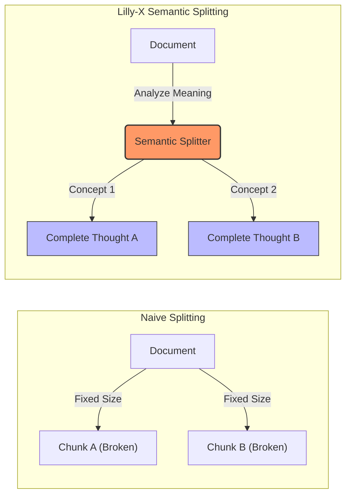
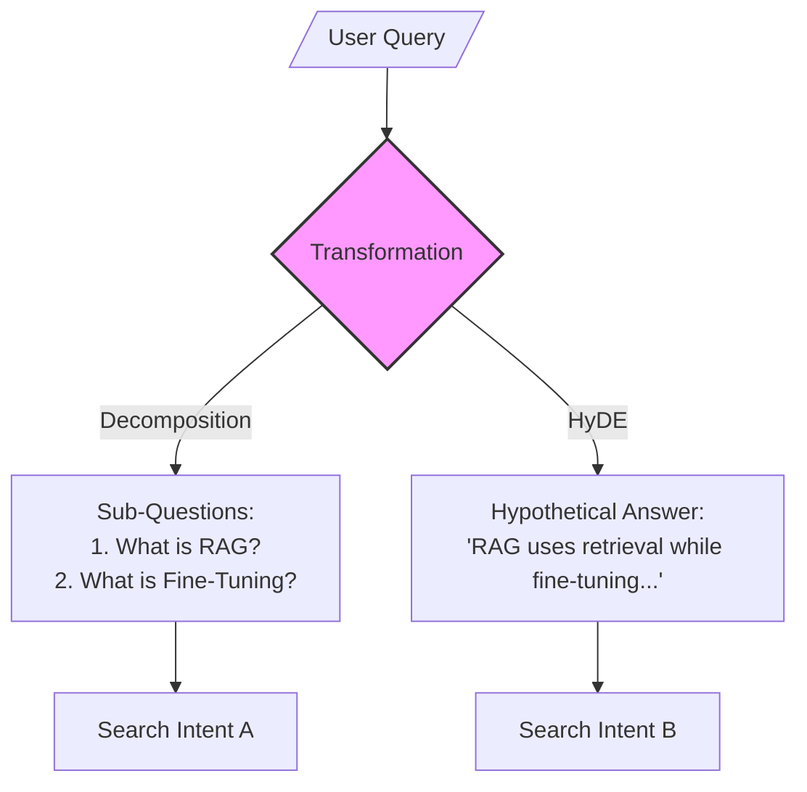
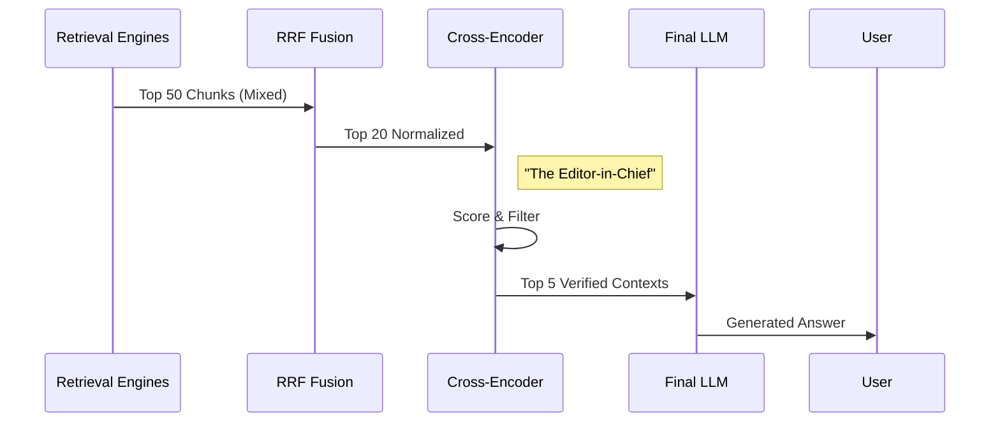

# Lilly-X: Beyond the Vector
## Anatomy of an Agentic Pipeline

[](https://github.com/UrbanElephant/Lilly-X)
[](https://www.python.org/)
[](https://neo4j.com/)
[](https://ollama.ai/)

> **"Most RAG systems are deaf. They listen to a user's query, convert it into math, and fetch the nearest matching paragraph. This is 'Naive RAG', and in 2024, it is insufficient."**

The **Lilly-X** framework demonstrates that a production-grade system must actively engineer the data, the query, and the result before the LLM ever generates a word. True intelligence comes from an **Agentic Pipeline**, not a database lookup.

---

## 1. The Ingestion Engine: Semantic Splitting

Amateurs chop documents by word count. They slice a PDF every 1024 tokens, often cutting a sentence—or a crucial idea—in half. This creates "context fragmentation."

* **The Semantic Shift:** Advanced pipelines do not count words; they detect meaning. Using tools like a `SemanticSplitterNodeParser`, the system analyses the text for "breakpoints"—moments where the topic shifts.
* **The Result:** We do not index arbitrary blocks of text. We index complete thoughts. This ensures that when the system retrieves a chunk, it retrieves a coherent concept, not a puzzle piece.


```mermaid
graph LR
    subgraph "Naive Splitting"
        Doc1[Document] -->|Fixed Size| Chunk1["Chunk A (Broken)"]
        Doc1 -->|Fixed Size| Chunk2["Chunk B (Broken)"]
    end

    subgraph "Lilly-X Semantic Splitting"
        Doc2[Document] -->|Analyze Meaning| Splitter(Semantic Splitter)
        Splitter -->|Concept 1| Idea1["Complete Thought A"]
        Splitter -->|Concept 2| Idea2["Complete Thought B"]
    end

    style Splitter fill:#f96,stroke:#333,stroke-width:2px
    style Idea1 fill:#bbf,stroke:#333
    style Idea2 fill:#bbf,stroke:#333
```

---

## 2. The Query Refinement Layer (Transformation)

Users are terrible at prompting. They ask vague, complex, or multi-part questions. A naive system searches for exactly what was asked. An agentic system searches for what was meant.

* **Decomposition:** If a user asks, "How does RAG compare to Fine-tuning for medical data?", a `QueryDecomposer` breaks this into atomic sub-questions.
* **HyDE (Hypothetical Document Embeddings):** Sometimes, the best way to find an answer is to hallucinate it first. The `HyDEGenerator` creates a "perfect" fake answer and searches for real documents that match the answer's pattern.


```mermaid
graph TD
    UserQuery[/"User Query"/] --> Router{Transformation}
    
    Router -->|Decomposition| SubQ["Sub-Questions: <br/>1. What is RAG?<br/>2. What is Fine-Tuning?"]
    Router -->|HyDE| FakeAns["Hypothetical Answer:<br/>'RAG uses retrieval while fine-tuning...'"]
    
    SubQ --> Search1[Search Intent A]
    FakeAns --> Search2[Search Intent B]

    style Router fill:#f9f,stroke:#333,stroke-width:2px
```

---

## 3. The Triad: Hybrid Retrieval

Vector search is powerful, but it is imprecise. It understands "canine" means "dog," but it struggles with specific acronyms like "Q3-2024" or complex entity relationships.

The solution is **Hybrid Retrieval**—running three engines in parallel:

* **Vector Search:** Captures high-level concepts and semantic meaning.
* **BM25 (Keyword):** Captures exact matches for technical terms, names, and IDs.
* **Graph Search:** Traces relationships. While vectors measure distance, graphs measure pathways. A `GraphRetriever` (powered by Neo4j) finds the hidden connections between entities.

```mermaid
graph TD
    RefinedQuery[Refined Query] --> Vector[Vector Store<br/>(Semantics)]
    RefinedQuery --> Keyword[BM25<br/>(Keywords)]
    RefinedQuery --> Graph[Neo4j Graph<br/>(Relationships)]
    
    Vector --> Results1[List A]
    Keyword --> Results2[List B]
    Graph --> Results3[List C]
    
    style Graph fill:#00A86B,stroke:#333,stroke-width:2px,color:white
```

---

## 4. The Quality Control: Fusion & Reranking

Retrieving data is easy. Knowing what matters is hard. When three different engines return results, you face a ranking problem.

* **Fusion:** Advanced systems use **Reciprocal Rank Fusion (RRF)** to normalise and merge these disparate lists into a single leaderboard.
* **Reranking:** The top results are passed to a **Cross-Encoder Reranker**. This is the system's "Editor-in-Chief." It ruthlessly grades every retrieved chunk for relevance, discarding the noise.


```mermaid
sequenceDiagram
    participant Engines as Retrieval Engines
    participant Fusion as RRF Fusion
    participant Rerank as Cross-Encoder
    participant LLM as Final LLM
    
    Engines->>Fusion: Top 50 Chunks (Mixed)
    Fusion->>Rerank: Top 20 Normalized
    Note right of Rerank: "The Editor-in-Chief"
    Rerank->>Rerank: Score & Filter
    Rerank->>LLM: Top 5 Verified Contexts
    LLM->>User: Generated Answer
```

---

## The Agentic Imperative

We must stop viewing RAG as a storage problem. It is a **reasoning problem**.

The Lilly-X architecture proves that the magic is not in the generation. It is in the **Semantic Splitting** that preserves meaning, the **Query Transformation** that clarifies intent, and the **Hybrid Fusion** that ensures precision. Build the pipeline, and the intelligence will follow.

---

## PS: The Codebase

**Sovereignty requires transparency.** I am sharing the code so you can move beyond theory and inspect the mechanics of a Sovereign Engine yourself. An experimental preview of the GraphRAG code is already included in the repo.

> [!IMPORTANT]
> This is a **proof-of-concept**, not a commercial product. It demonstrates that you do not need a data centre for robust intelligence. You just need the right foundation and the will to build it.

---

## 🚀 Quick Start

### Prerequisites

- **Hardware:** 16+ CPU cores, 32GB+ RAM (128GB recommended)
- **Software:** Python 3.12, Docker/Podman, Ollama
- **OS:** Linux (Fedora/RHEL recommended for SELinux + Podman integration)

### Installation

```bash
# Clone the repository
git clone https://github.com/UrbanElephant/Lilly-X.git
cd Lilly-X

# Create virtual environment
python3.12 -m venv .venv
source .venv/bin/activate

# Install dependencies
pip install -r requirements.txt

# Pull Ollama model
ollama pull qwen3-coder:30b

# Start infrastructure
./scripts/start_neo4j.sh
podman run -d --name qdrant -p 6333:6333 qdrant/qdrant:latest

# Ingest your documents
mkdir -p data/docs
cp /path/to/your/documents/*.pdf data/docs/
./scripts/run_graph_ingestion.sh

# Launch UI (optional)
streamlit run src/app.py
```

### Verification

```bash
# Check Neo4j
firefox http://localhost:7474
# Credentials: neo4j / password

# Query the knowledge graph
MATCH (n)-[r]->(m) RETURN n, r, m LIMIT 25
```

---

## 📂 Project Structure

```
Lilly-X/
├── src/
│   ├── advanced_rag/          # Query transformation, fusion, reranking
│   ├── config.py              # Central configuration
│   ├── ingest.py              # Standard RAG ingestion
│   ├── ingest_graph.py        # GraphRAG ingestion
│   ├── rag_engine.py          # Core RAG engine
│   └── app.py                 # Streamlit UI
├── scripts/
│   ├── start_neo4j.sh         # Neo4j container orchestrator
│   └── run_graph_ingestion.sh # Ingestion pipeline
├── data/docs/                 # Your documents (gitignored)
├── tests/                     # Verification scripts
└── requirements.txt           # Python dependencies
```

---

## 🔧 Architecture Deep Dive

For details on the implementation, consult:

- **[QUICKSTART.md](QUICKSTART.md)** - Step-by-step setup guide
- **[CONTRIBUTING.md](CONTRIBUTING.md)** - Development guidelines
- **[SCRIPTS_CONTEXT.md](SCRIPTS_CONTEXT.md)** - Script documentation

### Core Components

| Component | Implementation | Purpose |
|-----------|---------------|---------|
| **Semantic Splitter** | `SemanticSplitterNodeParser` | Preserves conceptual coherence |
| **Query Decomposer** | `src/advanced_rag/query_transform.py` | Breaks complex queries into sub-intents |
| **HyDE Generator** | `src/advanced_rag/query_transform.py` | Hypothetical document generation |
| **Hybrid Retriever** | `src/advanced_rag/retrieval.py` | Vector + BM25 + Graph fusion |
| **RRF Fusion** | `src/advanced_rag/fusion.py` | Reciprocal rank fusion |
| **Cross-Encoder Reranker** | `src/advanced_rag/rerank.py` | Final quality filter |

---

## 🎯 Design Philosophy

### 1. Privacy First
- **100% Local:** All inference runs on your hardware
- **No Cloud Dependencies:** Ollama for LLM, Neo4j for graph data
- **GDPR Compliant:** Your data never leaves your machine

### 2. Hardware Optimized
- **Tested on AMD Strix Halo:** Ryzen AI MAX+ 395 (32 cores, 128GB RAM, 32GB VRAM)
- **CPU-Friendly:** Embeddings run on CPU (ROCm instability workaround)
- **Timeout Tuning:** 1-hour LLM timeout for large documents

### 3. Production Ready
- **Container Native:** Podman/Docker orchestration
- **SELinux Hardened:** Managed volumes for Fedora/RHEL
- **APOC & GDS Enabled:** Graph algorithms and data science ready

---

## 🐛 Common Issues

### Neo4j Permission Denied
```bash
# Use managed volumes, not bind mounts
podman volume create neo4j_managed_storage
# Already configured in start_neo4j.sh
```

### Ollama Timeout
```python
# Increase timeout in config.py
Settings.llm = Ollama(
    model="qwen3-coder:30b",
    request_timeout=3600.0,  # 1 hour
)
```

### "Too Many Open Files"
```bash
# Increase file descriptor limit
ulimit -n 65535
# Already configured in run_graph_ingestion.sh
```

---

## 📜 License

MIT License - See [LICENSE](LICENSE) for details.

---

## 🙏 Acknowledgments

Built with:
- [LlamaIndex](https://github.com/run-llama/llama_index) - RAG framework
- [Neo4j](https://neo4j.com/) - Graph database
- [Ollama](https://ollama.ai/) - Local LLM inference
- [Qdrant](https://qdrant.tech/) - Vector search

---

**The future of AI is local. The future of RAG is agentic. Welcome to Lilly-X.**
