# Lilly-X | Local Precision RAG System

[](https://github.com/yourusername/lilly-x)
[](https://www.python.org/)
[](LICENSE)

> **Production-Grade RAG with Two-Stage Retrieval & Incremental Indexing**

Lilly-X is a precision-focused local RAG system designed for engineering teams who need reliable, source-cited answers from their technical documentation. Built on battle-tested open-source components with enterprise-grade features.

---

## ✨ What Makes Lilly-X Different

### 🎯 Two-Stage Retrieval (Fetch & Rerank)
- **Stage 1**: Cast a wide net—retrieve 25 candidates using vector similarity
- **Stage 2**: Apply cross-encoder reranking (BAAI/bge-reranker-v2-m3) for semantic precision
- **Result**: LLM receives only the top 5 most relevant chunks

**Why This Works**:
- ✅ **Recall**: Broad initial search ensures no relevant content is missed
- ✅ **Precision**: Reranker uses deeper semantic understanding than vector similarity alone
- ✅ **Efficiency**: LLM processes fewer, higher-quality chunks

### ⚡ Incremental Indexing
- **MD5 hash tracking** of every document
- **Skip unchanged files** automatically
- **Resume-safe**: Failed ingestion? Just restart—only new/modified files are processed
- **Performance**: 10x faster re-ingestion when testing with existing docs

### 🧠 "Golden Source" Metadata Enrichment
Every chunk is enriched with:
- **Structured Metadata**: Document type, authors, key dates (LLM-extracted)
- **Contextual Summaries**: Summaries of prev/next chunks to prevent "lost context"
- **Synthetic Q&A**: Questions this chunk can answer (improves retrieval matching)
- **Entity Extraction**: People, organizations, technologies

### 🤖 Professional AI Persona
Lilly-X identifies itself and follows strict rules:
1. Answer ONLY from provided context
2. Cite source filenames explicitly
3. Admit when information isn't available
4. Be concise and technical

---

## 🏗️ Architecture

```mermaid
flowchart LR
    User[👤 User Query] --> Retrieval[📊 Two-Stage Retrieval]
    
    subgraph Stage1 [Stage 1: Broad Retrieval]
        Retrieval --> Vector[Vector Search<br/>Top 25 Candidates]
    end
    
    subgraph Stage2 [Stage 2: Reranking]
        Vector --> Rerank[🎯 Cross-Encoder<br/>bge-reranker-v2-m3]
        Rerank --> Top5[Top 5 Results]
    end
    
    Top5 --> LLM[🧠 Mistral-Nemo 12B<br/>with Lilly-X Persona]
    LLM --> Response[✅ Source-Cited Answer]
    
    style Rerank fill:#f9f,stroke:#333,stroke-width:2px
    style Top5 fill:#bfb,stroke:#333,stroke-width:2px
```



### Tech Stack

| Component | Technology | Purpose |
|-----------|-----------|---------|
| **Vector Store** | Qdrant | Fast similarity search with HNSW indexing |
| **LLM** | Ollama (Mistral-Nemo 12B) | Local inference with 8192 token context |
| **Embeddings** | BAAI/bge-m3 | 1024-dim multilingual embeddings |
| **Reranker** | BAAI/bge-reranker-v2-m3 | Cross-encoder for semantic reranking |
| **Framework** | LlamaIndex | RAG orchestration & metadata extraction |
| **UI** | Streamlit | ChatGPT-like web interface |
| **Container** | Podman | Rootless Qdrant deployment |

**Hardware Optimization**: Optimized for AMD Ryzen AI MAX-395 with 32GB iGPU VRAM and ROCm acceleration.

---

## 🚀 Quick Start

### Prerequisites

- **Python 3.12** (3.10/3.11 compatible, **3.14+ not supported**)
- **Podman** (rootless container runtime)
- **Ollama** (running natively on host)
- **128GB RAM** recommended (16GB minimum)

### Installation

```bash
# 1. Clone repository
cd /path/to/your/workspace
git clone <repo-url> LLIX
cd LLIX

# 2. Create virtual environment
python3.12 -m venv venv
source venv/bin/activate

# 3. Install dependencies
pip install -r requirements.txt

# 4. Create environment file
cp .env.template .env
# Edit .env to customize settings

# 5. Verify Ollama is running
curl http://localhost:11434/api/tags

# Pull models if needed
ollama pull mistral-nemo:12b
```

### Start the System

```bash
# All-in-one startup (Qdrant + Streamlit)
bash start_all.sh
```

The script will:
1. ✅ Check if Qdrant is healthy (or start/create container)
2. ⏳ Wait for Qdrant to become ready (with retry logic)
3. 🌐 Launch Streamlit UI

Access at: **http://localhost:8501**

### Ingest Your Documents

```bash
# 1. Add documents to data/docs/
cp /path/to/your/docs/*.pdf data/docs/

# 2. Run ingestion (with incremental indexing)
bash run_ingestion.sh
```

**Incremental Indexing in Action**:
- **First run**: Processes all files, creates `ingestion_state.json`
- **Subsequent runs**: Only processes new/modified files
- **Safe to interrupt**: Data persists incrementally to Qdrant

---

## 📊 Configuration

All settings via `.env` or environment variables (leverages `pydantic-settings`):

### Core Settings

| Variable | Default | Description |
|----------|---------|-------------|
| `QDRANT_URL` | `http://localhost:6333` | Qdrant REST API endpoint |
| `QDRANT_COLLECTION` | `tech_books` | Collection name |
| `OLLAMA_BASE_URL` | `http://localhost:11434` | Ollama API endpoint |
| `LLM_MODEL` | `mistral-nemo:12b` | LLM for generation |
| `EMBEDDING_MODEL` | `BAAI/bge-m3` | Embedding model (1024-dim) |

### Two-Stage Retrieval

| Variable | Default | Description |
|----------|---------|-------------|
| `RERANKER_MODEL` | `BAAI/bge-reranker-v2-m3` | Cross-encoder model |
| `TOP_K_RETRIEVAL` | `25` | Candidates fetched in Stage 1 |
| `TOP_K_FINAL` | `5` | Results after Stage 2 reranking |

### Performance Tuning

| Variable | Default | Description |
|----------|---------|-------------|
| `CHUNK_SIZE` | `1024` | Semantic chunk size |
| `CHUNK_OVERLAP` | `200` | Overlap between chunks |
| `BATCH_SIZE` | `16` | Embedding batch size |

---

## 🛠️ Engineering Principles

### No Magic, Just Engineering
- **Type Safety**: Pydantic models for all configs and metadata
- **Explicit State**: Ingestion state persisted to JSON, not hidden caches
- **Observability**: Detailed logging at every stage (health checks, retries, processing)

### Idempotent Operations
- **Startup Script**: Handles existing containers gracefully, force IPv4
- **Ingestion**: Hash-based change detection prevents duplicate work
- **Error Recovery**: Soft fail logic (proceeds if container running despite health check failures)

### Human Architect, AI Sous-Chef
- **Structured Prompts**: Metadata extraction uses Pydantic models for validation
- **Graceful Degradation**: If reranker fails to load, falls back to single-stage retrieval
- **Flexible Types**: `Union[str, List[str]]` with validators handle LLM output variability

---

## 📁 Project Structure

```
LLIX/
├── src/
│   ├── config.py           # Centralized settings (pydantic-settings)
│   ├── database.py         # Qdrant client singleton
│   ├── rag_engine.py       # Two-stage retrieval logic
│   ├── ingest.py           # Golden Source pipeline + incremental indexing
│   └── app.py              # Streamlit UI
├── data/
│   └── docs/               # Your documents (PDF, MD, TXT)
├── start_all.sh            # Robust startup script (Qdrant + UI)
├── start.sh                # Streamlit launcher
├── run_ingestion.sh        # Ingestion wrapper
├── requirements.txt        # Python dependencies
├── .env.template           # Environment template
└── ingestion_state.json    # Hash tracking for incremental indexing
```

---

## 🎯 Usage Examples

### Query the System

```python
from src.rag_engine import RAGEngine

engine = RAGEngine()
result = engine.query("How do I configure the reranker?")

print(result.response)
# "According to config.py, you can set RERANKER_MODEL..."

# View sources
for node in result.source_nodes:
    print(f"Source: {node.node.metadata['file_name']}")
    print(f"Confidence: {node.score:.2f}")
```

### Streamlit UI Features

- **ChatGPT-like Interface**: Conversational Q&A
- **Source Citations**: Expandable source viewer with:
  - Re-Rank Confidence scores (0-1)
  - Document metadata (type, author, dates)
  - Synthetic Q&A and entity tags
- **"Showing Top 5 results from Re-Ranker (Cross-Encoder)"** badge for transparency

---

## 🔧 Troubleshooting

### Qdrant Won't Start

```bash
# Check container status
podman ps -a | grep qdrant

# View logs
podman logs qdrant

# Force recreation
podman rm -f qdrant
bash start_all.sh
```

### Health Check Fails but Container Running

The startup script handles this automatically (soft fail logic). If you see:
```
⚠️ Health check failed but container is running. Proceeding...
```

This is expected behavior (IPv4/IPv6 binding quirk). The system will proceed safely.

### Ingestion Errors (Pydantic Validation)

If you see `pydantic_core.ValidationError` during metadata extraction:
- The system automatically handles this with the `@field_validator` in `DocumentMetadata`
- Lists from LLM are auto-converted to comma-separated strings
- Failures gracefully default to "Unknown"

### Python 3.14+ Issues

**Do not use Python 3.14+**. Known issues include:
- LlamaIndex import errors
- Streamlit incompatibilities
- asyncio weak reference errors

**Solution**:
```bash
rm -rf venv
python3.12 -m venv venv
source venv/bin/activate
pip install -r requirements.txt
```

---

## 📈 Performance

### Latency Benchmarks (AMD Ryzen AI MAX-395)

| Metric | Value |
|--------|-------|
| **First Token (Cold)** | ~2-3s |
| **Full Response (avg)** | ~8-10s |
| **Retrieval Time** | ~500ms (Stage 1) + ~200ms (Stage 2) |
| **Embedding Time** | ~50ms/chunk (batch of 16) |

### Incremental Indexing Gains

| Scenario | Files Processed | Time |
|----------|----------------|------|
| **Initial Ingestion** | 100 files | ~25 min |
| **Re-run (no changes)** | 0 files | ~5 sec |
| **1 file modified** | 1 file | ~15 sec |

---

## 🤝 Contributing

See [CONTRIBUTING.md](CONTRIBUTING.md) for development workflow and "Inner Loop" protocols.

**Key Principles**:
- TDD: Write tests for new extractors/validators
- Type annotations required for all functions
- Pydantic models for structured data (no dicts)
- Idempotent operations (scripts should be re-runnable)

---

## 📚 Documentation

- **[INGESTION.md](INGESTION.md)**: Detailed ingestion pipeline documentation
- **[VERIFICATION.md](VERIFICATION.md)**: System health checks
- **[QUICKSTART.md](QUICKSTART.md)**: Step-by-step setup guide

---

## 🗺️ Roadmap

### v2.6 (Planned)
- [ ] Conversation memory (multi-turn context)
- [ ] Query history with re-run capability
- [ ] Embedding model hot-swap support

### v3.0 (Vision)
- [ ] GraphRAG with Neo4j knowledge graphs
- [ ] LangGraph agentic supervisor pattern
- [ ] Multi-strategy retrieval (HyDE, Parent Document)

---

## 📄 License

Proprietary - Lilly-X Project

---

## 🙏 Acknowledgments

Built with:
- [LlamaIndex](https://www.llamaindex.ai/) - RAG orchestration
- [Qdrant](https://qdrant.tech/) - Vector database
- [Ollama](https://ollama.ai/) - Local LLM inference
- [Streamlit](https://streamlit.io/) - Web UI
- [HuggingFace](https://huggingface.co/) - Embeddings & Reranker models

Hardware optimization inspired by AMD ROCm community best practices.
