# Lilly-X: Reasoning GraphRAG Architect 🧠🕸️


Lilly-X is a local, privacy-first RAG system that **thinks before it searches**. It combines **Query Decomposition** (Reasoning) with **Hybrid Retrieval** (Vector + Graph) to answer complex engineering questions.

## 🚀 Capabilities (Level 3 GraphRAG)

**Microsoft-style GraphRAG with Community Detection** - Lilly-X implements advanced multi-tier retrieval:

- **🌐 Global Search:** Can answer abstract questions like *"What are the main themes?"* by synthesizing Community Summaries instead of individual chunks. Uses keyword-based community retrieval.
  
- **🔬 Community Detection:** Automatically clusters entities using the **Leiden Algorithm** (via Neo4j GDS). Example: Detected **8 communities** in initial tests, each with LLM-generated summaries and keywords.

- **🔀 Hybrid Retrieval:** Intelligently combines three search strategies:
  - **Vector Search** (Qdrant) for semantic similarity
  - **Graph Traversal** (Neo4j) for entity relationships
  - **Community Context** for high-level thematic queries

- **🎯 Intent-Based Routing:** Automatically detects query intent (GLOBAL_DISCOVERY vs specific questions) and routes to the appropriate retrieval strategy.

### ⚠️ Prerequisites

- **Neo4j 5.x with GDS Plugin:** Community detection requires the [Graph Data Science library](https://neo4j.com/docs/graph-data-science/current/)
- **Python 3.10 - 3.12:** Python 3.14 is NOT supported yet (Pydantic v1 compatibility issues)
- See `.python-version` file for recommended version


## 🏗️ Architecture

```mermaid
graph TD
    User[👤 User Input] --> UI[🖥️ Streamlit UI]
    UI --> Engine[🧠 RAG Engine]
    
    subgraph Brain["🧠 The Brain - Reasoning Layer"]
        Engine --> Planner[Query Planner]
        Planner -->|Decompose| SubQ[Sub-Queries]
    end
    
    subgraph Eyes["👁️ The Eyes - Retrieval Layer"]
        SubQ --> Vector[Qdrant<br/>Dense Vector Search]
        SubQ --> Graph[Neo4j<br/>Knowledge Graph]
    end
    
    subgraph Synthesis["🔬 Synthesis Layer"]
        Vector --> Context[Aggregated Context]
        Graph --> Context
        Context --> LLM[Ollama<br/>Local LLM]
        LLM --> Answer[✨ Final Answer]
    end
    
    Answer --> UI
    
    style Brain fill:#e1f5fe,stroke:#01579b,stroke-width:2px
    style Eyes fill:#f3e5f5,stroke:#4a148c,stroke-width:2px
    style Synthesis fill:#e8f5e9,stroke:#1b5e20,stroke-width:2px
```



## 🔄 The Reasoning Loop

```mermaid
sequenceDiagram
    participant U as 👤 User
    participant A as Lilly-X UI
    participant P as Query Planner (LLM)
    participant D as Data Stores

    U->>A: "Compare LoRA and QLoRA"
    A->>P: Analyze Intent & Plan
    P-->>A: Plan: [Define LoRA, Define QLoRA, Compare]
    
    loop For each Sub-Query
        A->>D: Hybrid Search (Vector + Graph)
        D-->>A: Retrieved Facts
    end
    
    A->>A: Synthesize & Cite Sources
    A-->>U: 📝 Structured Response
```



## 🚀 Key Features

- **🧠 Query Decomposition**: Complex questions broken into atomic sub-queries
- **🕸️ Hybrid Retrieval**: Combines dense vector search (Qdrant) with symbolic knowledge graphs (Neo4j)
- **🎯 Intent Classification**: Automatically identifies factual, workflow, or comparison queries
- **📊 Thinking Process UI**: Visual sidebar showing reasoning steps in real-time
- **🔒 100% Local**: All LLM inference runs on your hardware via Ollama
- **🔧 Robust JSON Parsing**: Uses `json_repair` for fault-tolerant LLM output handling

## 🛠️ Quick Start

### Prerequisites

- **Python 3.10 - 3.12** (⚠️ Python 3.14 is NOT supported - see [Capabilities](#-capabilities-level-3-graphrag))
- **Neo4j 5.x with GDS Plugin** for community detection (see [Setup Guide](NEO4J_GDS_SETUP.md))
- **Podman** or Docker for databases
- **Ollama** installed with models: `mistral-nemo:12b`, `nomic-embed-text`


### Installation

```bash
# 1. Clone and navigate to project
git clone <your-repo-url>
cd LLIX

# 2. Start Infrastructure (Neo4j + Qdrant)
podman-compose up -d

# Check containers are running
podman ps

# 3. Setup Python Environment
python3.11 -m venv venv
source venv/bin/activate  # On Windows: venv\Scripts\activate
pip install --upgrade pip
pip install -r requirements.txt

# 4. Configure Environment
cp .env.template .env
# Edit .env if you need to change defaults

# 5. Ingest Your Documents
# Place PDFs in ./data/docs/
python -m src.ingest

# 6. Launch Lilly-X
streamlit run src/app.py
```

Visit `http://localhost:8501` to start querying! 🎉

## 📁 Project Structure

```
LLIX/
├── src/
│   ├── app.py              # Streamlit UI with reasoning visualization
│   ├── rag_engine.py       # Core hybrid retrieval engine
│   ├── ingest.py           # Document ingestion pipeline
│   ├── prompts.py          # LLM prompt templates
│   ├── schemas.py          # QueryPlan and data models
│   ├── graph_ops.py        # Neo4j entity resolution
│   ├── memory.py           # Conversation history manager
│   └── config.py           # Centralized configuration
├── data/
│   └── docs/               # Place your PDFs here
├── compose.yaml            # Podman/Docker infrastructure
├── .env                    # Environment configuration
└── requirements.txt        # Python dependencies
```

## ⚙️ Configuration

Key settings in `.env`:

```ini
# LLM Settings
LLM_MODEL=mistral-nemo:12b
EMBEDDING_MODEL=BAAI/bge-m3

# Retrieval Strategy (semantic | sentence_window | hierarchical)
RETRIEVAL_STRATEGY=semantic

# Database Connections
NEO4J_URL=bolt://localhost:7687
NEO4J_PASSWORD=password
QDRANT_URL=http://localhost:6333

# Performance
TOP_K=3
TOP_K_FINAL=5
BATCH_SIZE=16
```

## 🎨 UI Features

- **🧠 Agent Reasoning Sidebar**: Live display of query decomposition
  - Shows sub-queries with intent badges (📊 Factual, ⚙️ Workflow, ⚖️ Comparison)
  - "Direct Retrieval" indicator for simple queries
- **⚡ Live Token Streaming**: Real-time generation with tokens/second metrics
- **📊 Performance Metrics**: Detailed timing breakdown (retrieval vs generation)
- **📄 Source Attribution**: Expandable source nodes with scores and metadata
- **🔍 Debug Context**: Full transparency into retrieval decisions

## 🐛 Troubleshooting

### Neo4j Permission Denied (Podman/SELinux)

If you see `chown: cannot read directory '/data': Permission denied`:

```bash
# Stop containers
podman-compose down

# The compose.yaml already has :Z suffix for SELinux
# Just recreate the containers
podman-compose up -d
```

### Query Planning Fails

If you see JSON parsing errors, ensure:
- Ollama is running: `ollama list`
- Model is loaded: `ollama pull mistral-nemo:12b`
- Check logs: The system has fallback to simple query if decomposition fails

### Python 3.13+ Build Errors

```bash
# Install Python 3.11
sudo apt install python3.11 python3.11-venv  # Ubuntu/Debian
# or
brew install python@3.11  # macOS

# Recreate virtual environment
rm -rf venv
python3.11 -m venv venv
source venv/bin/activate
pip install -r requirements.txt
```

## 🔒 Privacy & Security

- ✅ **100% Local Execution**: All LLM inference runs on your hardware via Ollama
- ✅ **No External Services**: Documents never leave your machine
- ✅ **Full Data Control**: No API keys or cloud dependencies required
- ✅ **Open Source Stack**: Qdrant, Neo4j, Ollama, LlamaIndex

## � Tech Stack

| Component | Technology | Purpose |
|-----------|-----------|---------|
| **LLM** | Ollama (Mistral-Nemo 12B) | Query planning & answer generation |
| **Embeddings** | BGE-M3 (HuggingFace) | Dense vector representations |
| **Vector DB** | Qdrant | Semantic similarity search |
| **Graph DB** | Neo4j | Entity relationships & knowledge graph |
| **Framework** | LlamaIndex | RAG orchestration |
| **UI** | Streamlit | Interactive chat interface |
| **Orchestration** | Podman/Docker Compose | Infrastructure management |

## ℹ️ Project Status

This project is a **Proof of Concept (PoC)** designed for educational purposes and architectural demonstration. It serves as a reference implementation for **Advanced RAG patterns** including:

- Query Decomposition (Reasoning-before-Retrieval)
- Hybrid Vector + Graph Retrieval
- Multi-turn conversation with entity disambiguation
- Sentence Window & Hierarchical chunking strategies

Feedback and discussions are welcome via [Issues](https://github.com/UrbanElephant/lilly-x/issues).

---

**Built with ❤️ for privacy-conscious AI enthusiasts**
